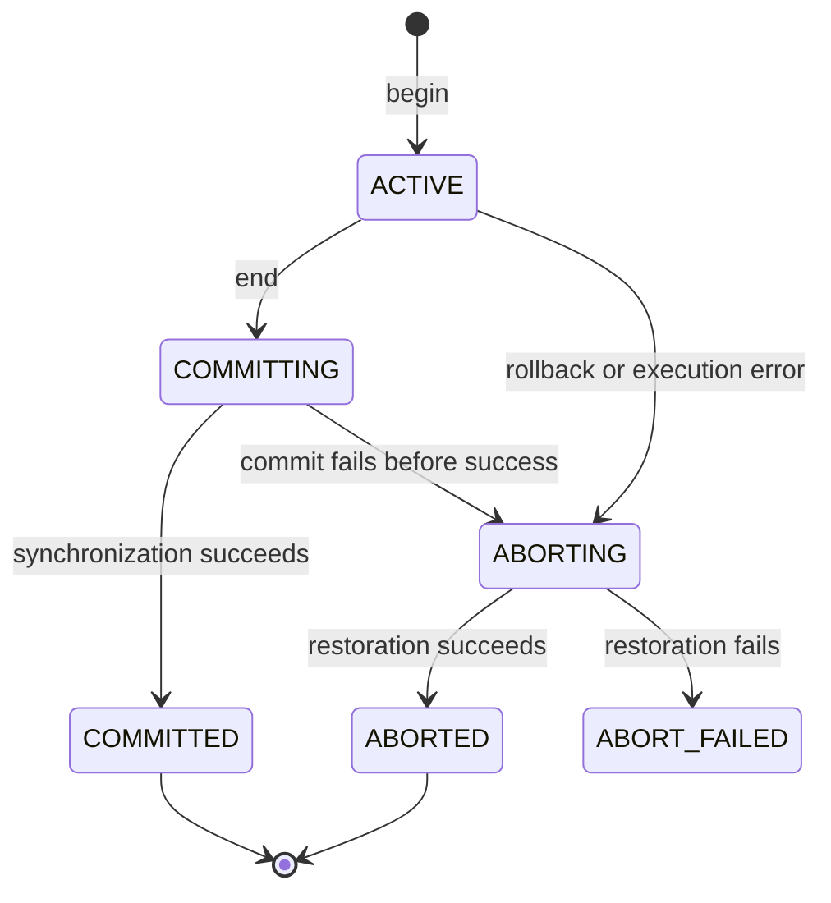

# ETAPA_08.md

## Stage 8 — Transactions and Concurrency

**Part:** Relational Database  
**Revision:** 2026-09-22

**Status:** Tasks 8.1–8.10 foundations completed; Tasks 8.11–8.30 pending implementation/evidence.

**Prerequisite:** Stage 7 Tasks 7.1–7.40 completed, including CREATE and EXPLAIN.  
**Roadmap:** PLAN.md, Section 13.  
**Repository inspected:** Base-de-Datos-2/MINI-DBMS, `main`, commit `25fb7916d15e7dd4f43911b415ede00c09257a48`.  

- **Task 8.1 current checkout:** `main`, commit `bf381e3d98673509f928b4a95fe410658e5312c6`; inspection and 436 passing focused baseline tests in `docs/ETAPA_08_TASK_8_1_INSPECTION.md`.
- **Task 8.2 adopted contract:** `docs/transactions.md` and `PROJECT_CONTEXT.md`; this is a design decision, not running transaction support.
- **Tasks 8.3–8.6 foundation:** `docs/ETAPA_08_TASK_8_3_8_6.md`; control-only empty groups and access intents exist.
- **Tasks 8.7–8.10 concurrency primitives:** `docs/ETAPA_08_TASK_8_7_8_10.md`; S/X grants, waits, deadlock detection and short physical latches exist. Coordinated data execution still awaits undo and engine integration.
- **Following work:** Complete the remaining Stage 9 integration, then Stage 10 experiments and delivery. Preserve the authorized emergency Stage 9 work.

This is an implementation plan, not a new academic specification or a claim that transaction support already exists. The repository records Stage 7 extension closure and 2,742 passing tests in its audit; that is historical repository evidence. Task 8.1 records the current-checkout test result separately.

## 1. Goal

Allow independent sessions to execute grouped statements against the same database safely. Each session must be able to begin a transaction, read its own changes, commit them, or abort and undo them. Conflicting transactions must wait or abort according to a defined policy, while compatible readers and operations on independent tables can make progress.

The required demonstration uses real threads and the project's own storage, indexes, parser, planner, and executor. It must reproducibly show an unsafe interleaving and the corresponding protected behavior.

The editor/engine continues to accept **one SQL statement per submission**. A transaction spans several submissions associated with the same session. Transaction grouping does not require script parsing or executing multiple statements in one request.

## 2. Authority and evidence

| Source | What it establishes |
|---|---|
| REQUIREMENTS.md, Section 7 | BEGIN TRANSACTION / END TRANSACTION, concurrency control, and a thread-based demonstration of contention and its correction. |
| PLAN.md, Section 13 | Transaction Manager, shared/exclusive locking as the recommended direction, lifecycle tests, and the mandatory demonstration. |
| PROJECT_CONTEXT.md | Existing persistence, Catalog/runtime ownership, SQL semantics, maintenance failure behavior, and the recommended locking direction. |
| AGENTS.md | Project implementation restrictions, regression gates, architectural and documentation rules. |
| ETAPA_07.md and docs/ETAPA_07_EXTENSION_AUDIT.md | Completed SQL baseline, manifest CREATE, constraints, explanations, and explicit absence of transaction rollback/concurrency. |
| 05 Control de Concurrencia.pdf | ACID (PDF page 6), serializable schedules/conflicts (pages 25–43), locking, deadlocks and prevention/detection (pages 65–74). |
| 05 Database Recovery.pdf | Difference between local, system, and media failures (page 5), and before-images/undo versus redo/recovery (pages 7–10). |

The supplied lecture PDFs are conceptual references, not instructions to reproduce PostgreSQL or implement every recovery algorithm. The original assignment PDF was not reread for this revision; academic scope is grounded in the repository's REQUIREMENTS.md. If a later instructor clarification changes the required guarantees, update the scope before implementing the conflicting behavior.

Repository references at the inspected revision:

- [Requirements](https://github.com/Base-de-Datos-2/MINI-DBMS/blob/25fb7916d15e7dd4f43911b415ede00c09257a48/REQUIREMENTS.md).
- [Roadmap](https://github.com/Base-de-Datos-2/MINI-DBMS/blob/25fb7916d15e7dd4f43911b415ede00c09257a48/PLAN.md).
- [Stage 7 extension audit](https://github.com/Base-de-Datos-2/MINI-DBMS/blob/25fb7916d15e7dd4f43911b415ede00c09257a48/docs/ETAPA_07_EXTENSION_AUDIT.md).
- [SQL executor](https://github.com/Base-de-Datos-2/MINI-DBMS/blob/25fb7916d15e7dd4f43911b415ede00c09257a48/engine/query/executor.py).
- [Database owner](https://github.com/Base-de-Datos-2/MINI-DBMS/blob/25fb7916d15e7dd4f43911b415ede00c09257a48/engine/database/owner.py).

## 3. Starting point and consequences

| Observed baseline | Consequence for Stage 8 |
|---|---|
| engine/transactions/__init__.py is a placeholder. | Implement the transaction subsystem; do not mistake a reserved package for functionality. |
| SqlEngine owns one active SELECT result and is explicitly a single-session facade. | Add separate sessions sharing one database owner and one transaction/lock manager. Never share one mutable active-result field across clients. |
| QueryEnvironment borrows live storage/index objects; plans retain references. | Protect registry changes, refresh stale bindings after restoration, and define per-table runtime generations. |
| Database owns manifest, Catalog, runtime registry and permanent handles. | Make it the common coordination boundary and expose a session factory or equivalent. |
| PageManager uses an unbuffered shared seek/read/write handle, mutable headers, and counters. | Logical S locks alone do not make simultaneous readers safe; add short physical latches or equivalent safe positional I/O. |
| MutationService flushes writes and may retain a successful DELETE prefix after failure. | Add transaction-level undo covering all prior statements. Index repair alone is not abort. |
| Sequential reorganization and index maintenance can move RIDs or replace files. | Avoid naive logical inverse INSERT/DELETE as the sole rollback method. |
| Managed manifest v1 exposes Heap and B+ tables/indexes; legacy registered environments exercise other structures. | Keep manifest v1 restrictions. Test transaction adapters for Sequential, clustered B+, and Hash using existing registered fixtures. |
| CREATE publishes several files and a manifest with ordinary-error compensation. | Preserve standalone CREATE; exclude it inside explicit transactions in this stage and coordinate it with active sessions. |
| EXPLAIN does not execute rows; ANALYZE executes a SELECT exactly once. | Preserve the distinction while applying the appropriate schema/data locks. |
| Stage 9 has a process-level admission guard and legacy owner/allowlists. | Keep it until session-aware HTTP integration is verified. Core concurrency evidence must use the new engine sessions. |

## 4. Required scope and design choices

### Academic requirements versus implementation choices

The assignment requires transaction grouping, safe concurrent access, and the threaded demonstration. Task 8.2 adopted the following project design, with detailed lifecycle, limits, and failure rules in `docs/transactions.md` and `PROJECT_CONTEXT.md`. Implementation and verification remain pending.

| Area | Adopted Stage 8 design decision (implementation pending) |
|---|---|
| Deployment | One process and one canonical database owner per physical database; multiple thread-driven sessions. No distributed/process-shared lock manager. |
| SQL controls | Required BEGIN TRANSACTION and END TRANSACTION; END commits. Add ROLLBACK as a small team-selected control for explicit abort. COMMIT alias, nested transactions and savepoints remain out of scope. |
| Default behavior | Standalone DML/SELECT runs in an implicit transaction. Preserve the existing single-statement engine interface. |
| Isolation | Table-level S/X locking; hold both S and X until successful commit or completed abort. This is rigorous 2PL, a stronger variant of strict 2PL. |
| Resource identity | Database identity plus stable table identity; aliases and alternative access paths resolve to the same resource. |
| Schema coordination | Separate database schema gate: S for ordinary transactions, X for standalone CREATE. Acquire schema before table resources. |
| Deadlocks | Wait-for graph including incompatible holders and queue-order blockers; abort the requesting transaction when its new wait closes a cycle. Bounded wait timeout and cancellation are separate safeguards. |
| Undo | Bounded streaming before-image snapshots of each table's complete physical file set, captured once before its first mutation under X. Restore that set on abort. |
| Commit | Finish validation and synchronize touched files using existing flush/fsync behavior before marking committed and releasing locks. |
| Recovery boundary | Undo for ordinary in-process failures and orderly shutdown. No claim of crash-atomic multi-file commit, WAL recovery, or power-loss recovery. |
| DDL | CREATE outside explicit transactions only, behind schema X; no hidden implicit commit of an active transaction. |
| SQL dialect | Preserve the completed no-NULL dialect, constraints, handwritten parser, existing joins/aggregates, and exactly one statement per call. |

Table locking intentionally sacrifices write concurrency within a table. It protects full scans, equality searches, ranges, joins, and missing-key reads against conflicting inserts/deletes without introducing row/gap locks. A database-wide mutex around all execution is not an acceptable final substitute: compatible readers and independent-table operations must overlap.

### What atomicity means here

A successful explicit transaction applies all its supported DML. An ordinary execution failure or ROLLBACK restores its pre-write table states, including earlier successful statements, before another transaction may use them. Statement-level affected-row counts inside an open transaction are provisional and do not imply commit.

Existing Stage 7 writes may reach disk before commit. Therefore rollback information is required even without a buffer pool. Temporary before-image files serve in-process abort; they are not WAL or a tested restart-recovery protocol. State this limitation instead of describing the stage as full crash-safe ACID.

### Explicit exclusions

- Multiple SQL statements per submission, .sql script execution, SQL UPDATE, savepoints, nested transactions, isolation-level selection, and MVCC.
- Row/page/gap lock optimization, intention-lock hierarchies beyond the defined schema gate, lock escalation, and distributed transactions.
- Transactional CREATE/ALTER/DROP; implicit commit around DDL is also excluded.
- Buffer replacement, a new buffer pool, ARIES, redo logging, checkpoints, and recovery after process/power failure.
- Rewriting Stage 6 external algorithms or widening the managed manifest's accepted storage/index types merely to test concurrency.
- Removing the emergency HTTP guard or building a new frontend as a shortcut to this stage's engine tests.
- Final Stage 10 performance campaigns. The demo and small correctness measurements remain in scope.

## 5. Session, SQL, and lifecycle contracts

### One statement at a time

Each block below is a distinct call through the same session:

```sql
BEGIN TRANSACTION;
```

```sql
INSERT INTO alumnos VALUES (10, 'Eva', 1, 18);
```

```sql
SELECT * FROM alumnos WHERE id = 10;
```

```sql
END TRANSACTION;
```

The SELECT must see that session's own insert. A conflicting session cannot see the uncommitted row. Its request waits or becomes a defined victim; after commit it can see the row. Required `--` comments, case-insensitive keywords, quoted strings and optional final semicolons retain Stage 7 behavior.

Do not call an implicit transaction after every statement while claiming the BEGIN/END group is atomic. A session identifier, not the currently running OS thread, owns the group. Reject simultaneous calls on the same session; independent sessions may use different threads.

### Transaction state machine



Waiting is an observable activity of an ACTIVE transaction, not a commit or abort. ABORT_FAILED leaves the database unavailable until an explicit repair/reopen policy establishes consistency; never reuse it as if rollback succeeded. A session is IDLE when it has no active transaction. Terminal transaction reports remain distinguishable from the reusable session.

| Event | Required behavior |
|---|---|
| BEGIN in idle session | Allocate a new transaction ID and attach its context to that session. |
| Nested BEGIN, END/ROLLBACK without active group | Structured protocol error; no hidden commit and no new transaction. |
| Ordinary execute error in explicit group | Abort the entire group, including earlier writes; report the cause and abort result. This includes validation, unsupported SQL, and lock failures. |
| Pure prepare/describe error | No writes, implicit commit, or abort merely from inspecting a plan. |
| Another statement while a SELECT result is open | Session-busy protocol error; preserve the active group until the caller closes/drains or requests ROLLBACK. |
| END with an open result | Reject; do not silently consume or commit it. |
| ROLLBACK/session close | Close owned results, undo if necessary, then release locks. |
| Implicit SELECT EOF or explicit early close | Finish the read-only implicit transaction and release its locks; preserve complete/partial result reporting. |
| Explicit SELECT EOF or early close | Release cursor resources but keep transaction locks until END/ROLLBACK. |
| Implicit INSERT/DELETE success | Commit before returning a committed command result. |
| CREATE inside explicit group | Reject without implicit commit; treat as execute failure and abort the group under the declared error policy. |

After an automatically aborted group, a later END must not return success for that group. A new explicit group requires a fresh BEGIN. A later standalone statement may follow the normal implicit-transaction path once the session is idle and usable.

## 6. Locking and physical safety

### S/X compatibility between different transactions

| Requested / held | S | X |
|---|---|---|
| S | Compatible | Wait/conflict |
| X | Wait/conflict | Wait/conflict |

Reacquiring one's own sufficient lock is idempotent. S-to-X upgrade retains S while waiting and upgrades only when no other incompatible owner remains. It must participate in deadlock handling; two upgrades can form a cycle. No transaction releases a logical data lock early and later acquires another.

| Operation | Data lock policy |
|---|---|
| SELECT, including aggregates and joins | S on every referenced base table before row access; aliases deduplicate. |
| INSERT | X on target before constraint reads, uniqueness checks, snapshot capture, or writes. |
| DELETE | X on target before discovery/spooling as well as the mutation pass. |
| EXPLAIN SELECT | Protect schema/binding; do not open data cursors or create runtime metrics. No data S required if inspection is genuinely metadata-only. |
| EXPLAIN ANALYZE SELECT | Same S requirements as SELECT; hold until the group ends or the implicit analysis completes. |
| CREATE outside explicit group | Schema X for definition validation, initialization, publication, and cleanup. |

Obtain schema protection before resolving table identity. Prepared plans must revalidate/rebind after acquiring execution locks, particularly after a rollback replaces handles. Stable metadata inspection may use short schema protection; prepare must not leave an implicit transaction or data lock stranded. A physical helper that reads index data during planning must either be moved under the data lock or made metadata-only.

Logical locks protect transactions. Physical latches protect short shared operations such as seek+read, header updates, counters, index caches, and registry publication. Never wait on a transaction lock while holding a storage latch, session-manager mutex, registry latch, or the lock-manager mutex. Never hold a physical latch across a yielded row, user callback, full transaction, or wait for another thread.

## 7. Undo and commit design checkpoint

### Adopted before-image design (implementation pending)

For each table first written by a transaction:

1. Acquire X and validate the current table/index runtime generation.
2. Determine its full physical write set: base organization files, every associated index, headers, free lists, and persistent validity markers. Include any auxiliary permanent files the operation can replace.
3. Flush a consistent current state and stream copies into an owned undo directory, in bounded chunks. Record original lengths and a complete snapshot descriptor. Do not write until the entire set is captured successfully.
4. Apply normal mutations using existing maintenance code. Reuse the same original snapshot for later writes to that table in the group.
5. On commit, synchronize modified structures before publication of COMMITTED. Cleanup of obsolete snapshots follows the irreversible success point; cleanup failure after commit must not turn success into a fictitious rollback.
6. On abort, stop owned cursors, restore all modified sets while X remains held, remove only transaction-created replacement artifacts, restore exact file lengths, reopen/refresh affected runtime objects, and validate rows/indexes before releasing protection.

Restoration must cover memory as well as disk: allocation headers, free-space maps, B+ roots, Hash directories, validity flags, cached nodes, and every registry reference to replaced handles. Invalidate affected prepared plans through generation checks. Other sessions must not retain a usable stale pointer after waiting for the lock.

Do not copy/restore the whole database: another transaction may have committed to an independent table. Do not restore a global manifest from an old snapshot. Explicit DML leaves the manifest unchanged because concurrent DDL is excluded by schema protection. Any shared physical file discovered during inspection requires a corresponding shared lock resource or a revised write-set design.

Snapshot cost is proportional to the first-written table/index sizes, not only the rows changed. Bound memory, open handles, total snapshot disk usage, and admitted transactions; reject insufficient space before mutation and record the overhead. An operation-level or page-level undo alternative is acceptable only after proving coverage of splits, reorganization, RID changes, file replacement, index failure markers, and partial writes. Do not substitute a list of inverse row operations without that proof.

### Commit failure and rollback failure

While committing, retain X locks and undo images until every required flush/fsync succeeds. If an ordinary synchronization error occurs before the success point, attempt full abort. Never report committed merely because an individual MutationService call already flushed.

If restoration or post-restore validation fails, quarantine the database before waking blocked requests. Cancel pending waits and prevent new grants/access against that owner. Retain diagnostic/undo artifacts and report ABORT_FAILED. Closing a corrupted handle and releasing a lock does not repair data. Cleanup errors must preserve the original cause without masking the final database availability state.

No automatic recovery of interrupted transactions on restart is claimed. Define a conservative unclean-close marker/orphan-artifact policy so abandoned undo files are not silently treated as a validated recovery protocol. A successful orderly close/reopen must preserve committed data and exclude successfully aborted writes.

## 8. Task sequence

| Task | Work | Dependencies |
|---|---|---|
| 8.1 | Inspect Stage 7 closure and integration boundaries | Current repository |
| 8.2 | Freeze transaction, isolation, failure and undo decisions | 8.1 |
| 8.3 | Add transaction model, state transitions, and errors | 8.2 |
| 8.4 | Add database-owned sessions and coordination | 8.3 |
| 8.5 | Extend handwritten SQL control parsing | 8.2–8.3 |
| 8.6 | Define lock resources and statement access sets | 8.2, existing AST/binder |
| 8.7 | Implement thread-safe S/X grants and release | 8.3, 8.6 |
| 8.8 | Implement waiting, upgrades and cancellation | 8.7 |
| 8.9 | Implement deadlock detection and timeout policy | 8.8 |
| 8.10 | Make shared physical reads and registries safe | 8.1–8.4 |
| 8.11 | Implement bounded undo snapshot capture | 8.6–8.7, 8.10 |
| 8.12 | Implement exact restore and runtime invalidation | 8.11 |
| 8.13 | Implement transaction commit | 8.4, 8.11–8.12 |
| 8.14 | Implement abort and failure quarantine | 8.9, 8.12–8.13 |
| 8.15 | Integrate explicit and implicit execution | 8.4–8.14 |
| 8.16 | Integrate SELECT cursors and external operators | 8.15 |
| 8.17 | Integrate INSERT and primary-key conflicts | 8.15 |
| 8.18 | Integrate DELETE, RID movement and rebuilds | 8.15, 8.17 |
| 8.19 | Coordinate standalone CREATE and schema changes | 8.15 |
| 8.20 | Integrate EXPLAIN and ANALYZE | 8.16, 8.19 |
| 8.21 | Add truthful transaction/lock metrics and tracing | 8.7–8.20 |
| 8.22 | Complete session cancellation and shutdown | 8.14–8.20 |
| 8.23 | Verify isolation with controlled interleavings | 8.15–8.22 |
| 8.24 | Verify atomicity, failure handling and reopen | 8.11–8.22 |
| 8.25 | Build deterministic unsafe threaded demonstration | 8.21; disposable fixtures |
| 8.26 | Build protected demonstration and serial oracle | 8.23–8.25 |
| 8.27 | Run bounded stress and Stage 1–7 regressions | 8.23–8.26 |
| 8.28 | Define Stage 9 session integration handoff | 8.15–8.22 |
| 8.29 | Synchronize documentation | Begin at 8.2; finalize after 8.27–8.28 |
| 8.30 | Audit Stage 8 completion | All required tasks |

Add focused tests with each implementation task. The final verification tasks integrate that evidence; they are not permission to postpone all testing.

## 9. Detailed implementation tasks

### Task 8.1 — Inspect the completed implementation

**Actions:** Read the source-of-truth documents and Stage 7 audits. Record the actual commit and environment. Inspect SqlEngine, PreparedQuery, QueryResult, QueryEnvironment, Database, MutationService, PageManager, all storage/index replacement paths, and the emergency API guard. Inventory open-handle ownership, writes hidden inside helpers, mutable caches and counter resets. Locate actual tests and baseline commands. Identify callers that bypass the managed owner.

**Evidence:** A short `docs/ETAPA_08_TASK_8_1_INSPECTION.md` with module/interface map, current test results, and confirmed gaps. Historical test counts are labeled historical.

**Acceptance:** Every entry point that can read, mutate, rebuild, close, or replace shared permanent state is accounted for. No completed SQL capability is silently removed.

### Task 8.2 — Freeze the design and failure contract

**Actions:** Adopt or explicitly reconcile Sections 4–7. Document END-as-commit, ROLLBACK, session identity, rigorous table 2PL, schema gate, queue/deadlock policy, undo write sets, commit success point, catastrophic failure state, quotas, and supported deployment. Resolve how legacy environments obtain the same transaction coordinator. Define the application retry boundary and prepared-plan invalidation. Record the ordinary-failure versus crash-recovery limits.

**Evidence:** `docs/transactions.md` decision section and PROJECT_CONTEXT.md update with proposed/implemented status separated.

**Acceptance:** No programmer must guess whether END commits, an error rolls back, a cursor releases locks, or a failed restore permits continued use. Do not begin irreversible architectural rewrites under an unresolved contract.

### Task 8.3 — Implement transaction state and errors

**Actions:** Define TransactionId, transaction record, state machine, timestamps, held locks, touched tables, undo references, and terminal report. Use a synchronized monotonic ID allocator scoped to the owner. Add protocol, session-busy, lock-timeout, deadlock-victim, abort, and unavailable errors. Keep transaction state separate from cursor/result state.

**Tests:** Valid/invalid transitions, unique IDs across threads, terminal-state immutability, nested controls, and error metadata.

**Acceptance:** COMMITTED and ABORTED mean completed outcomes, not requested operations; ABORT_FAILED cannot masquerade as ABORTED.

### Task 8.4 — Add sessions under one database owner

**Actions:** Add `open_session()` or an equivalent factory that shares one TransactionManager, LockManager, Catalog and canonical runtime registry. Each session owns its SqlEngine facade, active group/result, and non-reentrant call guard. Preserve a default session for existing database.engine callers. Explicitly reject unsupported competing owners for one directory in-process. Define session close independently from database close. Adapt legacy registered environments to shared coordination without changing the managed manifest format.

**Tests:** Independent session/result state; one session busy while another progresses; accidental shared-session calls rejected; closing one session leaves others and shared files open.

**Acceptance:** Transaction ownership never depends solely on a Python thread-local global or a shared SqlEngine.active_result.

### Task 8.5 — Parse transaction controls manually

**Actions:** Add AST/control kinds and dispatch for exact BEGIN TRANSACTION, END TRANSACTION, and the adopted ROLLBACK command. Preserve the handwritten lexer/parser, source spans, comments, full-input checks and one optional semicolon. Controls go to the transaction layer, not through table-name binding. Reject unsupported aliases/options explicitly. Parsing alone cannot begin or end a transaction.

**Tests:** Mixed case, leading/trailing comments, malformed controls, unsupported nested syntax, and BEGIN followed by another statement in the same input. Confirm a rejected multi-statement call creates no transaction.

**Acceptance:** Grouping works through repeated individual calls, with no script splitter or parser generator.

### Task 8.6 — Map statements to lock resources

**Actions:** Resolve stable table IDs under schema protection. Extract every base table used by SELECT/join/ANALYZE; deduplicate aliases and use deterministic acquisition ordering within a statement. Determine X for INSERT and DELETE before validation or target discovery. Map physical base/index files to their owning table; indexes never use a separate conflicting lock domain that bypasses base-table protection. Define lock-free syntax versus schema-protected metadata inspection.

**Tests:** Aliases, self-join deduplication, multi-table joins, primary-key checks, missing-key SELECT, ranges, and a prepared plan resumed after a runtime generation change.

**Acceptance:** Every actual data access has adequate protection; no constraint check or DELETE discovery runs before X.

### Task 8.7 — Implement S/X grants and release

**Actions:** Implement the compatibility matrix with one short lock-manager mutex and per-resource ownership/request records. Support idempotent reacquisition, transaction-owned lock sets, release-all, and schema resource coordination. Expose read-only diagnostic snapshots without mutable internal references. Release logical locks only through validated terminal cleanup paths.

**Tests:** S/S allowed, S/X and X/X excluded, distinct resources independent, same-owner reuse, ownership errors, and release idempotence.

**Acceptance:** Lock-table invariants hold under concurrent requests. The mutex protects metadata briefly and is not held while waiting or doing I/O.

### Task 8.8 — Add waits, upgrades and cancellation

**Actions:** Use condition variables and predicate loops; release the manager mutex while blocked. Implement a defined queue order that avoids perpetual writer starvation. Upgrades keep S until grant or abort; deduplicate repeated requests. Wake eligible waiters after release/cancellation and recheck transaction/database state before granting. Support deadlines and cooperative cancellation without lost wakeups.

**Tests:** Waiter truly blocks then wakes; spurious notifications; two compatible readers; queued writer versus new readers; upgrade eligibility; cancellation/grant race; release while a waiter is registering.

**Acceptance:** No busy polling, silent lock stealing, unbounded retry inside the manager, or acquisition after abort/quarantine.

### Task 8.9 — Detect and resolve deadlocks

**Actions:** Maintain wait-for dependencies for incompatible holders and queue blockers, including upgrades. Detect cycles on dependency changes; reject/abort the requesting participant that closes a cycle under the adopted policy. Remove stale graph edges on grant, cancellation and termination. Signal victim cleanup outside the manager mutex and wait for rollback before exposing its data. Add finite timeout handling as a separate abort cause. Engine execution does not automatically replay arbitrary SQL or application work.

**Tests:** Opposite table order, two S-to-X upgrades, a long acyclic wait, queue-order dependencies, victim with earlier writes, timeout, and clean graph after completion.

**Acceptance:** A cycle is resolved deterministically with a reported victim and complete cleanup; the surviving transaction progresses. A timeout is not mislabeled as detected deadlock.

### Task 8.10 — Protect physical operations and runtime registries

**Actions:** Audit and latch seek+full-read/write sequences, allocation headers, mutable index read caches, file replacement, close, and registry publication. Use a documented latch ordering and avoid holding latches across iterator yields. Ensure shared readers do not overwrite the same file offset or reset each other's counters. Keep short administrative operations separate from logical transaction waits. Add runtime generation tracking for replaced table/index objects.

**Tests:** Forced interleaving between seek/read steps using test hooks, concurrent Heap/B+/Hash reads, close versus active session, registry replacement, and counter attribution.

**Acceptance:** S/S compatibility is physically safe, not merely logically permitted. Independent operations still overlap; the GIL is not the correctness argument.

### Task 8.11 — Capture bounded undo images before writes

**Actions:** Build per-table physical snapshot adapters and a transaction-owned undo store. Capture base and all associated index files consistently under X before the first permanent modification, including validity-marker writes. Copy in bounded chunks, record complete descriptors and lengths, and handle temporary paths safely. Do not snapshot again after the table has already changed within the same group. Enforce disk/handle quotas and clean partial captures before reporting failure.

**Tests:** Capture-before-write ordering; repeated writes use one original image; read-only groups produce no images; failure halfway through copying produces no permanent write; all index files included; tiny-memory large-file capture.

**Acceptance:** A transaction can recover its pre-write table state even if later maintenance partially changes several files.

### Task 8.12 — Restore bytes, metadata and live references

**Actions:** Implement table-scoped restore under retained X. Close affected owned handles safely, restore original file sizes/images, remove only owned replacement artifacts, and rebuild canonical runtime references through existing factories. Refresh cached roots/directories/free-space state and bump runtime generations. Ensure old prepared plans rebind/reject after waiting. Preserve unrelated tables and metadata.

**Tests:** INSERT and DELETE reversal, new-page truncation, B+ split/root/free-list restoration, Hash growth, Sequential reorganization, clustered-index RID movement, stale plan rejection, and a concurrent committed write to another table surviving restore.

**Acceptance:** Restored scans, index lookups, headers, constraints and live manager state agree. Restoring only logical rows or only disk bytes is insufficient.

### Task 8.13 — Commit with a defined success point

**Actions:** Enforce the no-open-result END policy, validate the transaction state, synchronize every modified base/index structure, and transition to COMMITTED before releasing its locks. Retain undo until synchronization succeeds. Return a transaction report that distinguishes commit from earlier statement completion. Make internal terminal cleanup idempotent. Treat post-commit undo-file cleanup failures as cleanup warnings requiring later removal, not as an aborted transaction.

**Tests:** Read-only commit, multi-statement/multi-table commit, flush failure before success, repeated terminal cleanup, and cleanup failure after successful commit.

**Acceptance:** END cannot return successful commit while writes remain unflushed or the group is already aborted. Clean reopen preserves the committed data.

### Task 8.14 — Abort the entire group and quarantine failed restoration

**Actions:** Close results and discovery spools; restore all modified tables, including changes from earlier successful statements. Retain protection until restoration/validation finishes. Coordinate deadlock/timeout abort with the session executor so two threads cannot restore one transaction concurrently. Preserve original errors and report final abort state. On unrecoverable restore failure, mark the owner unavailable, prevent grants and cancel waiting requests before releasing administrative resources.

**Tests:** Failure in statement two undoes statement one; partial DELETE then exception; lock victim with writes; double abort; failure restoring the second table; waiter never observes partial restoration.

**Acceptance:** Ordinary abort restores the group or explicitly fails closed. Stage 7's retained DELETE prefix is never reported as a successfully rolled-back transaction.

### Task 8.15 — Integrate transaction-aware execution

**Actions:** Route controls and statements through session context. Wrap standalone SELECT/INSERT/DELETE/ANALYZE in implicit transactions and attach grouped statements to the existing explicit one. Fully parse before effects, resolve/acquire resources before runtime validation/access, and revalidate prepared generations under locks. Define protocol errors versus execution failures exactly as Section 5. Keep supported raw storage helpers explicitly internal/exclusive or require transaction tokens at normal database entry points.

**Tests:** Separate BEGIN/INSERT/SELECT/END calls; own-write visibility; implicit statement success/failure; no accidental commit after each grouped statement; default legacy-facing engine compatibility.

**Acceptance:** All ordinary application execution paths share the same protection, with explicit committed/provisional command semantics.

### Task 8.16 — Integrate SELECT cursors and external operators

**Actions:** Acquire S on all sources before opening operators; keep explicit-group locks after EOF/early close. End an implicit read transaction only when its result is exhausted or closed. Preserve bounded external sorting/grouping/joining and temporary ownership. Handle iterator exceptions through transaction cleanup. Ensure a yielded cursor cannot be consumed concurrently through one session. Budget concurrent executions without sharing mutable operator contexts.

**Tests:** Reader blocks writer after partial iteration; explicit EOF retains S; implicit early close releases it; joins hold both tables; spills and operator failures close resources; simultaneous independent readers overlap.

**Acceptance:** Lazy execution does not release protection at execute() return or hold short physical latches throughout user think time.

### Task 8.17 — Integrate INSERT and constraints

**Actions:** Hold X before checking VARCHAR, key uniqueness and current index readiness. Capture undo before changing any persistent structure and call existing MutationService. Keep primary and secondary indexes synchronized. Return provisional statement counts inside a group and committed counts outside it. Route managed programmatic insertion through the same policy.

**Tests:** Two sessions insert the same primary key; one commits and the other then receives a duplicate error. If the first aborts, the waiter may insert successfully. Test overlength values, full pages, new allocation and index failures.

**Acceptance:** No check-then-insert race, lost index association, or unprotected database insertion path remains.

### Task 8.18 — Integrate DELETE, reorganization and index rebuilds

**Actions:** Acquire X before Stage 7's bounded target discovery and keep it through all deletions, rebuilds, flushes and transaction completion. Capture the pre-write physical set before mutation or invalidation markers. Preserve RID validation and maintenance behavior while wrapping failures in whole-group abort. Test all supported organization/index adapters through existing fixtures, without widening SQL DDL storage options.

**Tests:** Competing DELETE/INSERT; rollback after several rows deleted; rebuild failure; Sequential movement and clustered B+ associations; Hash and unclustered B+ lookups agree with the restored base scan.

**Acceptance:** A stale moving target cannot delete another transaction's row, and partial maintenance is recoverable at the group boundary.

### Task 8.19 — Coordinate standalone CREATE

**Actions:** Preserve Stage 7 manifest CREATE outside explicit groups. Acquire schema X before validation/publication, wait for schema S holders, and release only after success or completed compensated cleanup. Reject CREATE inside an explicit group without implicit commit. Protect pure metadata lists/prepare operations with a short schema latch/gate. Prevent file close or registry replacement while active data users borrow handles.

**Tests:** CREATE waits for a running transaction; existing readers remain valid; two concurrent CREATEs of the same name produce one success; group rejection undoes its earlier DML; unchanged-state failure before publication.

**Acceptance:** DDL remains usable and coordinated without claiming transactional DDL or exposing a half-published Catalog/manifest.

### Task 8.20 — Preserve EXPLAIN and integrate ANALYZE

**Actions:** EXPLAIN uses protected metadata and the real planner without running row operators. ANALYZE participates in the session's transaction and locks all SELECT sources, consumes exactly once, and closes resources before implicit completion. Separate lock-wait, planning and execution time. On execution failure, keep a truthful partial analysis report and the final transaction abort outcome. Preserve SELECT-only explanation children.

**Tests:** Non-executing EXPLAIN; blocked ANALYZE versus writer; ANALYZE after own insert; explicit locks remain after completed analysis; zero-row result; failure report and cleanup.

**Acceptance:** Explanation functionality survives the transaction layer without inventing runtime data or bypassing isolation.

### Task 8.21 — Add transaction metrics and event tracing

**Actions:** Expose transaction/session ID, state, held/requested resources, wait duration, blocker IDs, deadlock/timeout cause, undo bytes, commit/abort duration, and final outcome. Capture ordered events with a synchronized sequence number. Keep logical locks, physical latch waits, query I/O, and undo I/O distinguishable. Attribute I/O per execution/context rather than subtracting shared counters that other sessions update. Bound retained traces and disclose truncation.

**Tests:** Interleaved queries have separate metrics; aborted groups are not counted as commits; lock-wait events correspond to real blocking; snapshot I/O is not presented as ordinary SELECT I/O.

**Acceptance:** The demo can explain why a transaction waited/aborted and what happened, using real events rather than a fabricated timeline.

### Task 8.22 — Finish cancellation, close and orderly shutdown

**Actions:** Define cooperative cancellation and finite waits for session/database shutdown. Close active results, abort open groups, cancel queued requests, and join owned workers before closing shared files. The controller requests cancellation; the executor acknowledges a safe point before cleanup changes files it may be using. Preserve diagnostic state on failed abort and avoid deleting another session's temporary files.

**Tests:** Close idle/waiting/writing/streaming sessions; cancellation racing with grant; shutdown with an active group; restoration failure; second session remains usable after a normal peer disconnect.

**Acceptance:** No leaked lock, waiter, thread, cursor or temporary file remains after normal termination. No forced thread kill or premature shared-handle close is used as rollback.

### Task 8.23 — Verify isolation with controlled schedules

**Actions:** Use Events/Barriers and lock-manager hooks to force meaningful interleavings. Verify S/S overlap, S/X and X/X exclusion, independent-table concurrency, read-your-writes, no dirty reads, repeatable reads, phantom prevention under table S, conflicting primary keys, joins, upgrades, deadlocks and fairness behavior. Compare completed transaction histories to valid serial outcomes.

**Tests/evidence:** A matrix of schedule, expected blocked request, terminal states, resulting rows/indexes and bounded thread joins. Time limits detect hangs; sleeps alone do not prove ordering.

**Acceptance:** Tests establish transaction isolation and actual compatible overlap. They do not pass merely because the whole database is globally serialized.

### Task 8.24 — Verify atomicity, durability boundary and failures

**Actions:** Exercise explicit multi-statement groups and implicit mutations with fault injection at snapshot, base write, index write, spool, rebuild, flush, restore and publication boundaries. Reopen with fresh owners after orderly commit/abort. Include cross-table rollback while another transaction commits to an unrelated table. Preserve original schema, constraints and exact physical membership after abort. Test failed-restore quarantine separately.

**Acceptance:** Successful abort removes every effect of its group; commit survives clean reopen; unavailable state is explicit when restoration fails. Tests do not claim crash recovery from ordinary close/reopen evidence.

### Task 8.25 — Build the deterministic unsafe demonstration

**Actions:** Use two real threads and disposable project-engine data, with a test/demo-only adapter that bypasses transaction protection. Keep short physical operations serialized/latch-safe so the demonstration isolates a logical race rather than corrupting files. Each worker reads counter value 0, waits at a barrier, then replaces it with its previously computed value 1. Serialize each DELETE+INSERT replacement pair in this unsafe harness to obtain a reproducible lost update. Record both reads and final value 1.

**Acceptance:** The wrong result is produced by actual engine reads/writes and a controlled interleaving. No hard-coded fake result, generic Python-only shared integer, or production SQL/API switch disables locking.

### Task 8.26 — Build the protected demonstration and serial oracle

**Actions:** Repeat the same business operation using separate protected sessions and explicit transactions. Use existing SELECT/DELETE/INSERT; computation of old_value + 1 occurs in the demo application because SQL UPDATE is outside scope. Commit each complete replacement. If both readers retain S and upgrade, show the deadlock victim and retry its entire business transaction through a bounded application-level retry. Do not retry only INSERT using the stale value. Use synchronization hooks appropriate to the protected schedule; never require a blocked transaction to reach a barrier held by its blocker.

**Acceptance:** Two successfully committed increments produce final value 2, matching a serial execution. Reports distinguish attempts, aborts and two committed business operations. A separate schedule shows one writer waiting until another completes and a separate S/S schedule demonstrates compatible overlap.

### Task 8.27 — Run bounded stress and regression gates

**Actions:** Use seeded workloads with multiple sessions, limited iterations, fixed resource budgets and bounded joins. Exercise inserts/deletes/reads, failed groups, waits and rollback on the real structures. Validate row multisets, primary-key uniqueness, index/base agreement, empty lock tables and resource cleanup. Run the required complete Stage 1–7 regression suite and relevant API compatibility tests; run frontend build only if frontend files were actually changed or a required gate demands it.

**Acceptance:** Record exact commands, seeds, commit, environment, results and limitations. Stop extra stress once concrete risks and required gates are covered. These checks do not substitute for the deterministic concurrency tests.

### Task 8.28 — Specify the Stage 9 integration handoff

**Actions:** Document the session factory and lifetime, individual BEGIN/DML/END calls, session ownership across requests, busy/blocked/aborted/unavailable responses, cancellation, result variants and transaction-status display. Inventory the existing legacy API owner, SELECT-only allowlist, missing definition/explanation serialization, and admission guard. Preserve current demo behavior until an explicit adapter integration handles all of these consistently. Never hold the old global admission lock while waiting for a transaction whose END must arrive through that same lock.

**Acceptance:** Stage 9 has a concrete integration checklist. Core threaded Stage 8 correctness is independently demonstrated; the plan does not claim that HTTP concurrency or transaction controls already work in the editor.

### Task 8.29 — Update documentation without contradictions

**Actions:** Perform the synchronization in Section 13 alongside implementation. Preserve historical Stage 7 partial-failure descriptions as historical, explain the stronger Stage 8 wrapper, and distinguish raw internal APIs from coordinated public operations. Keep team choices separate from academic requirements. Publish examples as separate submissions and record crash-recovery and DDL limitations.

**Acceptance:** Current documentation consistently states the same session, locking, abort, commit, one-statement, and integration contracts. The stage remains incomplete if mandatory documentation is stale.

### Task 8.30 — Audit and close Stage 8

**Actions:** Audit each task and Definition of Done item against real implementation/tests. Rehearse the unsafe/protected demo from a clean disposable database. Record tested commit and commands in `docs/ETAPA_08_AUDIT.md`; include unsupported guarantees, snapshot overhead and outstanding Stage 9 integration. Update progress pointers only after evidence is complete.

**Acceptance:** All required gates pass and a teammate can reproduce the demonstration. Stage 8 closure does not automatically close Stage 9 or Stage 10.

## 10. Acceptance scenarios

Use SQL CREATE outside transactions to establish an isolated `alumnos` table and seed rows with individual INSERT calls. Tests requiring Sequential/clustered B+/Hash reuse existing setup fixtures and attach them to the same transaction abstractions. Session call names below are conceptual; adapt to established repository naming.

| Scenario | Controlled actions | Expected result |
|---|---|---|
| Grouped commit | A: BEGIN; INSERT id 10; SELECT id 10; END | A reads its row, then B can read committed id 10; reopen preserves it. |
| Explicit abort | A: BEGIN; INSERT id 11; ROLLBACK | id 11 absent in scan and all indexes; key can be reused. |
| Earlier statement undone | A: BEGIN; INSERT id 12; invalid duplicate/overlength insert | Entire A group aborts, including id 12; END cannot pretend to commit it. |
| No dirty read | A inserts id 13 under X; B SELECT requests S | B blocks; after A aborts B sees no id 13. |
| Repeatable/range read | A holds S after completed SELECT; B tries matching insert/delete | B waits until A ends; a repeated A SELECT sees stable data plus A's own changes. |
| Compatible readers | A and B SELECT same table, results intentionally held open | Both acquire S and can make progress before either finishes. |
| Independent tables | A modifies table T; B modifies U and commits; A aborts | B's U changes survive. A restores only its T files. |
| Deadlock | A X(T), B X(U), A requests U, B requests T | Defined victim aborts including prior writes; survivor progresses; no leaked edges. |
| Upgrade conflict | A and B S(T), then both request X(T) | Cycle is resolved; one group aborts; no early loss of S protection. |
| Cursor lifetime | A explicit SELECT closes early; B writes | B still waits until END/ROLLBACK. The implicit-read variant releases on close. |
| Failed DELETE | A deletes several targets before injected error | Entire A group restored, including prior statements and indexes. |
| Snapshot failure | Capture fails before first write | No mutation; temporary capture cleaned; group abort reported. |
| Failed restore | Restoration/validation fails | Owner unavailable; waiters fail rather than read inconsistent data. |
| DDL boundary | A active; B standalone CREATE | B waits for schema gate; CREATE inside A rejects and aborts A without hidden commit. |
| Explanations | EXPLAIN versus ANALYZE inside/outside a group | No row execution for EXPLAIN; one protected execution for ANALYZE; accurate completion flags. |
| Single-statement boundary | `BEGIN TRANSACTION; INSERT ...;` in one call | Full-input error; no new transaction and no insert. |
| Unsafe/protected comparison | Two business increments from zero | Unsafe controlled result 1; protected two committed increments result 2. |

Each blocking assertion needs explicit evidence that a request is queued/blocked and that it has not reached data access. A short elapsed-time threshold alone is insufficient proof.

## 11. Suggested modules and increments

| Location | Responsibility |
|---|---|
| engine/transactions/model.py | IDs, states, reports and context records. |
| engine/transactions/manager.py | Begin/commit/abort orchestration and lifecycle. |
| engine/transactions/locks.py | S/X resources, queues, upgrades, waits and diagnostics. |
| engine/transactions/deadlocks.py | Wait-for dependencies and cycle policy if a separate module helps. |
| engine/transactions/undo.py | Bounded before-image capture, restore and artifact ownership. |
| engine/transactions/session.py | Session identity and transaction-aware facade or equivalent. |
| Existing engine/query modules | Control AST/parser, resource discovery, protected preparation/execution and result lifetime. |
| Existing database/environment/storage/index modules | Shared owner integration, latches, snapshot adapters and generation invalidation. |
| tests/transactions/ | Unit, lifecycle, controlled schedules, failure and integration tests. |
| demos/transactions_demo.py or scripts/demo_transactions.py | Reproducible disposable unsafe/protected demonstration. |
| docs/transactions.md | Stable contract, design and examples. |
| docs/ETAPA_08_AUDIT.md | Verification and closure evidence. |

These are suggested names, not a mandate to create duplicate abstractions. Keep engine independence from HTTP/UI; transaction modules must not import FastAPI or React. Existing public imports and default-session behavior should remain compatible.

Recommended increments:

1. **Contracts and models:** 8.1–8.6. Agree on ownership and semantics before changing storage behavior.
2. **Concurrency primitives and physical safety:** 8.7–8.10. Prove grants/waits and S/S safety in isolation.
3. **Undo and completion:** 8.11–8.14. Prove whole-group restoration and commit failure semantics.
4. **Engine integration:** 8.15–8.22. Connect every existing SQL family and shutdown path.
5. **Evidence and closure:** 8.23–8.30. Verify isolation/atomicity, demonstrate the race, preserve regressions, synchronize documents.

Do not expose a half-implemented transactional mode as the default before undo, lifecycle and lock release work together.

## 12. Verification strategy

Use the repository's configured commands and environment. Examples after the named tests exist:

```bash
python -m pytest tests/transactions -q -W error
python -m pytest tests/query tests/database tests/api -q -W error
python -m pytest -q -W error -p no:cacheprovider
```

Record actual paths rather than inventing successful execution of these examples. No source tests were run simply to generate this document; implementation verification is a task in this plan.

Evidence must contain:

- Checked-out revision, Python/tool versions, commands, seeds, worker count and budgets.
- Transaction IDs, requested/granted locks, wait/abort causes, serial oracle and final data.
- Base/index validation after commit, rollback, failure, and orderly reopen.
- Measured overlap for compatible readers/independent tables and exclusion for conflicts.
- Resource closure, lock-table/graph emptiness, bounded undo memory and disk usage.
- Full regression results and explicit explanation of intentionally changed Stage 7 public failure semantics.

Preserve low-level Stage 7 maintenance tests where its internal contract remains unchanged. Update public session tests to assert whole-group rollback; do not weaken unrelated tests to accommodate transaction bugs.

## 13. Mandatory documentation synchronization

| Document | Update required |
|---|---|
| ETAPA_08.md | Actual decisions, task status, evidence and limitations. |
| PROJECT_CONTEXT.md | Session ownership, schema/table locks, latches, undo, commit/abort boundaries, error policy, metrics, and supported deployment. |
| PLAN.md | Stage 8 implementation/closure and remaining Stage 9/10 work; preserve emergency-demo history. |
| AGENTS.md | Replace “Stage 8 not started/no plan” when applicable; point to this plan and later real closure evidence. Preserve general requirements and testing rules. |
| docs/sql-grammar.md | BEGIN TRANSACTION, END TRANSACTION, ROLLBACK; one-statement grammar; unsupported control variants. |
| docs/sql.md | Per-session examples, implicit transactions, provisional versus committed counts, cursor rules and errors. |
| docs/transactions.md | Complete current isolation/failure contract and explanations of coarse locking/snapshot cost. |
| README.md | Startup/session/demonstration commands and current transaction limitations. |
| ETAPA_09.md, docs/demo.md and applicable API notes | Explicitly track adapter migration, session ownership, result serialization and when the old admission guard can be replaced. |
| Stage 7 and earlier audits | Preserve historical evidence; add forward references rather than rewriting past results as transactional. |
| REQUIREMENTS.md | Review; change only for an actual academic clarification. Do not describe table snapshots, ROLLBACK spelling, or graph policy as instructor mandates. |

Search current claims about “no transactions”, “single owner/session”, “DELETE prefix retained”, “no locks”, “Stage 8 pending”, “rollback”, “ACID”, and “safe concurrent API”. Resolve each at its correct layer. A raw PageManager may still have no transaction knowledge while its coordinator supplies protection; document that distinction accurately.

Generating this file does not edit the other documents or implement their promised features. Documentation synchronization is required during implementation and is a closure gate.

## 14. Definition of Done

### Transactions and sessions

- [x] Current Stage 7 implementation and closure evidence are inspected (Task 8.1; focused current-checkout baseline in `docs/ETAPA_08_TASK_8_1_INSPECTION.md`).
- [ ] BEGIN TRANSACTION and END TRANSACTION execute with the documented lifecycle.
- [ ] ROLLBACK and automatic abort behavior are implemented and documented as team choices.
- [ ] Exactly one statement per submission and required comment handling are preserved.
- [ ] Independent sessions share one correct coordinator without sharing active-result state.
- [ ] Nested controls, busy sessions, invalid terminal commands and session close are tested.
- [ ] Implicit transactions preserve existing ordinary statement usability.
- [ ] Successful statements inside a group remain provisional until commit.

### Concurrency and physical safety

- [ ] S/X compatibility, transaction-owned reacquisition, upgrades and terminal release are correct.
- [ ] All reads/writes, validation, DELETE discovery and relevant metadata access acquire adequate protection.
- [ ] Locks survive explicit cursor EOF/close until the group ends.
- [ ] Compatible readers and independent tables demonstrably overlap.
- [ ] Physical shared handles/caches/counters are safe under compatible logical reads.
- [ ] Waits use conditions without holding physical or manager latches during blocking.
- [ ] Deadlocks, queue dependencies, timeouts and cancellation have tested outcomes.
- [ ] Victim cleanup occurs before conflicting access is admitted.
- [ ] No dirty reads, lost updates or phantoms occur in the covered table-lock schedules.

### Undo and commit

- [ ] Complete table/index images exist before the first protected mutation.
- [ ] Undo memory, disk and handle usage have enforceable bounds.
- [ ] Abort restores every changed statement/table in the group and preserves unrelated commits.
- [ ] Allocation, file replacement, reorganization, RID changes and index validity are covered.
- [ ] Restored runtime objects and prepared-plan generations cannot use stale state.
- [ ] Commit synchronizes the complete write set before reporting success and releasing locks.
- [ ] Ordinary failures trigger full abort; failed restoration quarantines the owner.
- [ ] Clean reopen retains commits and excludes successfully aborted writes.
- [ ] Crash recovery is explicitly outside the demonstrated guarantee.

### Integration and evidence

- [ ] Existing SELECT/INSERT/DELETE, constraints, joins/groups/sorts, CREATE, EXPLAIN and ANALYZE remain correct under their documented boundaries.
- [ ] Sequential, clustered/unclustered B+, and Hash integration is verified through compatible existing fixtures.
- [ ] CREATE inside explicit transactions rejects without hidden commit; standalone CREATE is coordinated.
- [ ] Metrics and event traces describe actual execution and lock behavior without cross-session contamination.
- [ ] Cancellation/shutdown leave no live worker, lock, cursor or owned temporary artifact after normal cleanup.
- [ ] A deterministic unsafe demonstration produces a real lost update on disposable engine data.
- [ ] The protected threaded demonstration matches the serial oracle and reports retries/aborts honestly.
- [ ] Controlled interleaving, failure, bounded stress and required regression gates pass with recorded evidence.
- [ ] Stage 9 handoff preserves the existing guard until session-aware integration is verified.
- [ ] Documentation has no unresolved current-scope or guarantee contradictions.
- [ ] The Stage 8 audit and reproducible demonstration runbook are complete.

## 15. Working prompts

### First task

```text
Read AGENTS.md, REQUIREMENTS.md, PROJECT_CONTEXT.md, PLAN.md, ETAPA_07.md,
the Stage 7 extension audit, and ETAPA_08.md. Stages 1–7 are complete.
Perform Task 8.1: inspect real session/result ownership, borrowed runtime
handles, mutation failures, file replacement, persistence and the Stage 9
guard. Record the current commit and run the applicable baseline checks.
Preserve completed functionality. Do not implement transactions yet.
```

### Incremental implementation

```text
Implement the next incomplete dependency-ready task in ETAPA_08.md.
Use the adopted transaction contract and existing engine structures.
Keep one SQL statement per call and the handwritten parser. Add meaningful
tests for ownership, interleavings, failure and cleanup as applicable.
Update current documentation alongside the code and report actual results.
Do not replace the engine with another DBMS, add unplanned WAL/MVCC, or
remove the emergency API guard before its integration gates are met.
```

### Closure audit

```text
Audit Stage 8 against ETAPA_08.md. Verify complete transaction rollback,
commit publication, physical S/S safety, strict lock lifetime, deadlock
resolution, cursor ownership, index consistency and orderly reopen.
Run the controlled threaded unsafe/protected demo and regression gates.
Report actual evidence and distinguish in-process atomicity from crash
recovery, and engine concurrency from pending HTTP/UI integration.
Close Stage 8 only after its documentation and Definition of Done pass.
```

## 16. Handoff

After Stage 8 closes, return to the unfinished Stage 9 integration: stable sessions across requests, all SQL/result variants, transaction controls/status, cancellation, and verified replacement of the emergency admission guard. Then complete Stage 10 experiments and delivery using the real engine, including the documented costs of locking and undo where relevant.

Do not label all Part 1 work complete solely because transactions and the earlier emergency interface now exist.
