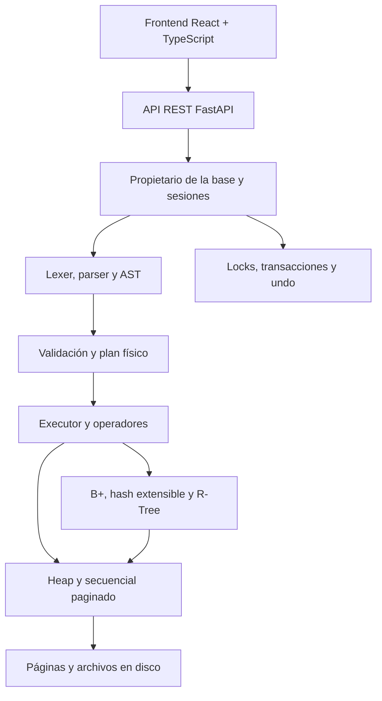

# MINI-DBMS — Minigestor de Base de Datos Multimodal

Proyecto de **Base de Datos 2, ciclo 2026-2**. Implementa un motor de base de
datos desde sus páginas y registros hasta la ejecución de SQL y la visualización
de sus resultados. La entrega actual se concentra en tablas relacionales y
datos espaciales.

El almacenamiento, los índices, el parser, los operadores y las transacciones
son implementaciones propias. React y FastAPI proporcionan la interfaz y el
transporte HTTP. PostgreSQL/PostGIS se utiliza únicamente como comparador en
los experimentos.

## Funcionalidades

| Módulo | Implementación |
|---|---|
| Almacenamiento | Páginas de 4 KiB, registros tipados y RID; Heap con reutilización de espacio; archivo secuencial paginado con inserción ordenada, borrado lazy y reorganización |
| Índices relacionales | B+ agrupado, B+ no agrupado y hash extensible, con persistencia y mantenimiento de índices |
| Procesamiento SQL | Lexer y parser escritos a mano; validación semántica, planificación y ejecución de un subconjunto de SQL |
| Algoritmos externos | Ordenamiento mediante k-way merge, agrupación por hash externo y joins mediante Grace Hash, Nested Loop o índices elegibles |
| Transacciones | Sesiones independientes, BEGIN TRANSACTION, END TRANSACTION, ROLLBACK, locks compartidos/exclusivos, cancelación y undo físico |
| Datos espaciales | R-Tree propio para puntos 2D, consultas por radio, k-NN y polígonos; distancias Haversine y Euclidiana |
| Interfaz | Tablas y esquemas, editor SQL, resultados tabulares, planes reales y exploración espacial |
| Experimentos | Comparaciones de estructuras relacionales y de búsqueda secuencial/R-Tree/GiST con 1 000, 10 000 y 100 000 registros |

Las Partes 3, 4 y 5 —texto, multimedia y aplicación multimodal— quedan para
las siguientes entregas.

## Arquitectura



El frontend consume contratos HTTP; no modifica páginas ni ejecuta algoritmos
de consulta. El plan mostrado describe los operadores y accesos que usa el
motor. El propietario de cada base controla los archivos, el catálogo, las
sesiones y la coherencia de los índices.

| Directorio | Responsabilidad |
|---|---|
| `engine/catalog/` | Tipos, esquemas y metadatos |
| `engine/storage/` | Registros, páginas, RIDs, archivos Heap y secuenciales |
| `engine/indexes/` | B+ y hash extensible |
| `engine/operators/` | Scans, filtros, proyección, ordenamiento, agrupación y joins |
| `engine/query/` | SQL, AST, binding, planificación y ejecución |
| `engine/transactions/` | Sesiones, locks, cancelación y undo |
| `engine/spatial/` | Geometría, R-Tree, consultas y persistencia espacial |
| `engine/database/` | Propietario de bases con manifiesto persistente |
| `api/` | API REST y adaptación de la base de demostración |
| `frontend/` | Aplicación React, cliente HTTP y componentes |
| `benchmarks/` | Generadores, mediciones y gráficos |
| `tests/` y `demos/` | Pruebas y demostración de concurrencia |
| `scripts/` | Preparación de datos y comprobaciones de integración |
| `docs/` | Guías técnicas y resultados experimentales |

## Instalación

Se necesita **Python 3.11 o superior**, **Node.js 20 o superior** y npm.
Ejecuta los comandos desde la raíz del repositorio. PostgreSQL no es necesario
para usar el motor, la API o la interfaz.

En Windows, desde PowerShell:

```powershell
python -m venv .venv
.\.venv\Scripts\python.exe -m pip install -e ".[test,api,bench]"
cd frontend
npm ci
npm run build
cd ..
```

En Linux o macOS:

```bash
python3 -m venv .venv
.venv/bin/python -m pip install -e ".[test,api,bench]"
cd frontend
npm ci
npm run build
cd ..
```

Los ejemplos siguientes utilizan `python` con el entorno virtual activado.
Si no lo activas, utiliza `.\.venv\Scripts\python.exe` en Windows o
`.venv/bin/python` en Linux/macOS.

## Ejecutar el proyecto

### Demostración relacional

Con el servidor detenido, prepara la base una sola vez:

```bash
python scripts/setup_demo.py
python -m api
```

Abre **<http://127.0.0.1:8000>**. La API sirve la interfaz compilada en
`frontend/dist`. Los datos se guardan en `data/generated/demo` y se reabren
en los siguientes arranques.

La muestra utiliza estudiantes, cursos e inscripciones. Incluye tablas
pequeñas con respuestas comprobables y tablas mayores para observar
ordenamiento, agrupación y joins externos.

### Demostración espacial

Detén el servidor anterior y prepara un directorio nuevo:

```bash
python scripts/setup_spatial.py
python -m api --spatial
```

Abre la misma dirección. Esta muestra contiene `tiendas` y `restaurantes`,
con columnas `id`, `nombre`, `latitud` y `longitud`, almacenadas en Heap.
Son puntos sintéticos locales; no representan un inventario comercial real.
El mapeo lógico `ubicacion` y los índices espaciales se reabren desde
`data/generated/spatial`.

`setup_spatial.py` exige un destino nuevo y no reemplaza una base existente.
Para preparar otra muestra, usa el mismo directorio en ambos comandos:

```bash
python scripts/setup_spatial.py --data-dir data/generated/spatial_nueva
python -m api --spatial --data-dir data/generated/spatial_nueva
```

### Escrituras y desarrollo

El servidor inicia en modo **solo lectura**. Para permitir inserciones,
borrados y creación/importación de tablas desde la interfaz:

```bash
python -m api --allow-writes
```

Añade `--spatial` si utilizas la muestra espacial. El modo se muestra en la
interfaz y también se valida en el servidor. Detén el proceso con `Ctrl+C`.
Usa un único proceso por directorio de datos; no actives múltiples workers
ni recarga automática del backend.

Para desarrollar el frontend, deja la API en el puerto 8000 y abre otra terminal:

```bash
cd frontend
npm run dev
```

Vite sirve en **<http://127.0.0.1:5173>** y reenvía `/api` al backend.
Después de cambiar el frontend, ejecuta `npm run build` para actualizar la
versión servida por el puerto 8000.

## Usar la interfaz

1. Selecciona una tabla para consultar sus columnas, organización e índices.
2. Escribe SQL o carga una consulta de ejemplo. Ejecuta con el botón o con
   `Ctrl + Enter` (`Cmd + Enter` en macOS).
3. Revisa las filas y el plan de ejecución. Desactivar **Usar índices** cambia
   la estrategia enviada al motor y permite comparar sus accesos.
4. Utiliza **BEGIN**, **END** y **ROLLBACK** para agrupar, confirmar o deshacer
   operaciones. Cada pestaña tiene una sesión independiente; una recarga
   inicia otra sesión y no repite automáticamente las escrituras.
5. En la base espacial, selecciona una tabla y consulta por radio, vecinos
   cercanos o polígono. El mapa resalta los resultados devueltos por el motor.

El **Explorador espacial** utiliza un mapa geográfico sin conexión, con
proyección Mercator y rejilla de coordenadas. Arrastra para desplazarlo, usa
`+`/`−` para cambiar el zoom y haz clic para elegir el centro de búsqueda.
Con el mapa enfocado, las flechas desplazan y `Enter` selecciona el centro
visible. Para un polígono, introduce un par `latitud, longitud` por línea.
**Actualizar puntos** renueva la vista desde la base.

**Cargar consulta en SQL** envía al editor la búsqueda de radio o vecinos,
junto con `mi_ubicacion`. El parámetro se muestra debajo de los paneles y se
conserva para ese envío. Para cambiarlo, vuelve a cargar la consulta desde el
mapa. Los vértices del polígono se consultan mediante el contrato espacial
tipado; no se presenta una sintaxis SQL de polígonos que el motor no soporta.

Los resultados HTTP son una **vista limitada**, con un máximo de 500 filas y
un límite de bytes. La interfaz distingue resultados vacíos, completos,
limitados y errores. Un total desconocido no equivale al número de filas de
la vista. Los planes preparados y las mediciones de ejecución se presentan
con su alcance correspondiente.

## Consultas de ejemplo

Con la muestra relacional:

```sql
SELECT name FROM students WHERE age > 20 ORDER BY name;

SELECT career, COUNT(*) AS total
FROM students GROUP BY career ORDER BY career;

SELECT s.name, e.course
FROM students AS s JOIN enrollments AS e ON s.id = e.student_id
ORDER BY s.name, e.course;

EXPLAIN ANALYZE SELECT * FROM students WHERE id = 3;
```

Con la muestra espacial:

```sql
SELECT * FROM tiendas
WHERE distancia(ubicacion, POINT(-12.0464, -77.0428)) < 5000;

SELECT id, nombre,
       distancia(ubicacion, POINT(-12.0464, -77.0428), 'euclidean') AS metros
FROM tiendas ORDER BY metros LIMIT 10;
```

Las coordenadas de `POINT` y de las consultas HTTP se escriben en orden
**latitud, longitud**. Ambas distancias se expresan en **metros**. Haversine
es la opción predeterminada; Euclidiana usa una proyección local con origen
en `(-12.0464, -77.0428)`.

El dominio actual es latitud `[-12.30, -11.80]` y longitud
`[-77.25, -76.75]`. Los polígonos son simples, sin huecos, e incluyen el
borde. Los empates de vecinos se resuelven por distancia y luego por id.

La API admite el parámetro `mi_ubicacion` sin interpolar SQL:

```json
{
  "sql": "SELECT * FROM restaurantes ORDER BY distancia(ubicacion, mi_ubicacion) LIMIT 10",
  "parameters": {"mi_ubicacion": [-12.0464, -77.0428]},
  "use_indexes": true
}
```

## API REST

El servidor publica la referencia interactiva en
**<http://127.0.0.1:8000/docs>**.

| Ruta | Uso |
|---|---|
| `GET /api/health` | Estado, modo y límites |
| `GET /api/tables` | Tablas registradas |
| `GET /api/tables/{id}` | Esquema, organización e índices |
| `POST /api/query` | SQL, resultados, plan y mediciones |
| `POST /api/sessions` | Abrir una sesión |
| `GET /api/spatial/tables` | Mapeos, convenciones y tablas espaciales registradas |
| `POST /api/spatial/query` | Consultas tipadas de radio, k-NN o polígono |

Las peticiones de una sesión llevan `X-Session-Token`. El token identifica
una sesión del motor y permanece en memoria en la interfaz. Las consultas
espaciales usan los mismos locks y transacciones que el resto de la base.

## Experimentos y gráficos

Las mediciones conservan sus datos, configuración y versiones de código.
Los resultados relacionales de los tres tamaños y la repetición posterior
de 1 000/10 000 se documentan por separado para no mezclar entornos en una curva.

| Comparación | Resultados |
|---|---|
| Heap frente a secuencial; B+ agrupado/no agrupado frente a hash | [Método y conclusiones](docs/EXPERIMENTOS.md), [gráficos y tablas](docs/experimentos/resultados.md) |
| Repetición relacional de 1 000 y 10 000, cinco repeticiones | [Guía](docs/experimentos/README.md), [11 gráficos y resultados](docs/experimentos/actualizados_1k_10k/resultados.md) |
| Secuencial frente a R-Tree y PostgreSQL GiST | [Método y conclusiones](docs/EXPERIMENTOS_ESPACIALES.md), [radio](docs/figuras/spatial/radius.png), [k-NN](docs/figuras/spatial/knn.png), [recursos](docs/figuras/spatial/recursos.png), [memoria](docs/figuras/spatial/memoria.png) |

La matriz espacial reúne 5 400 consultas medidas: tres tamaños, tres métodos,
radios de 1/5/10 km y k de 10/50/100, con 100 centros por configuración.
Los tiempos de cliente PostgreSQL incluyen su transporte y se distinguen de
los tiempos internos. Las cifras de memoria indican qué proceso se midió.

Para regenerar los gráficos espaciales desde los resultados conservados:

```bash
python -m benchmarks.spatial results --input benchmarks/results/spatial/2026-10-04 --output docs/figuras/spatial
```

## Pruebas

Desde la raíz, con el entorno virtual activo:

```bash
python -m pytest -q -W error
python -m demos.transactions_demo
python scripts/integration_check.py --backend-only
python scripts/spatial_integration_check.py --data-dir data/generated/check_spatial --report data/generated/check_spatial.json
```

La demostración con hilos reproduce una actualización perdida, ejecuta la
versión protegida y la compara con una ejecución serial. Las comprobaciones
de integración levantan sus propios servidores y bases temporales.
La comprobación espacial exige un directorio de datos nuevo; usa otro nombre
en `--data-dir` si ya ejecutaste ese comando.

Para el frontend:

```bash
cd frontend
npm test
npm run typecheck
npm run build
```

## Alcance y documentación

Se implementa un subconjunto de SQL, no todo el estándar. El R-Tree se mantiene
en memoria y persiste un árbol validado; no es un índice espacial paginado.
Haversine utiliza una esfera y Euclidiana es una aproximación local. El límite
de filas HTTP acota la respuesta, no toda la memoria consumida por una consulta.

Las transacciones ofrecen rollback y coordinación dentro de un proceso.
No se implementan WAL, recuperación automática después de un crash, locks
entre procesos ni commit atómico de múltiples archivos ante pérdida de energía.

- [Guía del frontend](docs/frontend.md).
- [SQL y ejecución](docs/sql.md), [gramática](docs/sql-grammar.md).
- [Transacciones y concurrencia](docs/transactions.md).
- [Convenciones y consultas espaciales](docs/spatial.md).
- [Configuración de despliegue](docs/despliegue.md).
- [Especificación del proyecto](Proyecto_Final.pdf).
