# Resultados de la Etapa 10

Mediana de las repeticiones, con [mínimo – máximo]. Generado por `python -m benchmarks report` a partir de: `benchmarks/results/part1_results.jsonl`, `benchmarks/results/part1_results_100k_files.jsonl`, `benchmarks/results/part1_results_100k_indexes.jsonl`.

## Inserción de todos los registros

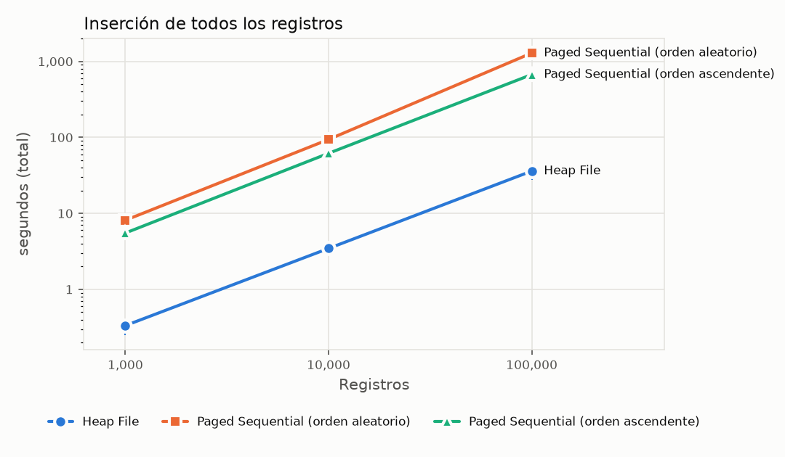

| Estructura | 1,000 (segundos (total)) | 10,000 (segundos (total)) | 100,000 (segundos (total)) |
|---|---:|---:|---:|
| Heap File | 0.333 [0.249 – 0.375] (n=5) | 3.453 [3.415 – 3.671] (n=5) | 36.0 [27.7 – 38.8] (n=3) |
| Paged Sequential (orden aleatorio) | 8.116 [8.029 – 9.348] (n=5) | 93.9 [90.4 – 98.0] (n=5) | 1,289.4 [1,281.4 – 1,306.9] (n=3) |
| Paged Sequential (orden ascendente) | 5.510 [5.455 – 5.920] (n=5) | 61.7 [59.8 – 66.8] (n=5) | 671.5 [661.7 – 725.0] (n=3) |

## Búsqueda por clave primaria (claves presentes)

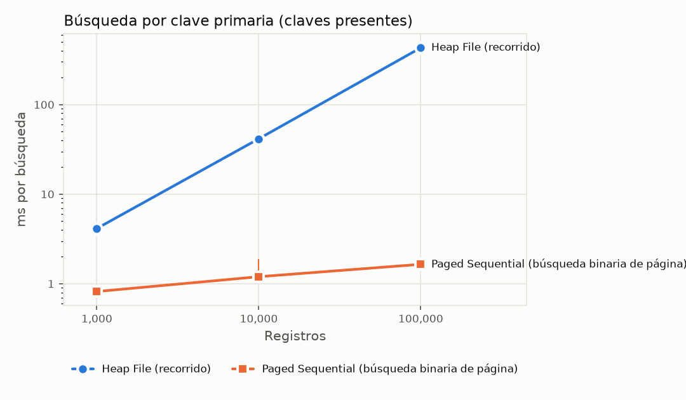

| Estructura | 1,000 (ms por búsqueda) | 10,000 (ms por búsqueda) | 100,000 (ms por búsqueda) |
|---|---:|---:|---:|
| Heap File (recorrido) | 4.139 [4.025 – 4.580] (n=5) | 41.5 [38.0 – 46.4] (n=5) | 430.9 [403.0 – 451.4] (n=3) |
| Paged Sequential (búsqueda binaria de página) | 0.818 [0.793 – 0.879] (n=5) | 1.197 [1.129 – 1.891] (n=5) | 1.647 [1.534 – 1.890] (n=3) |

## Espacio en disco tras la carga

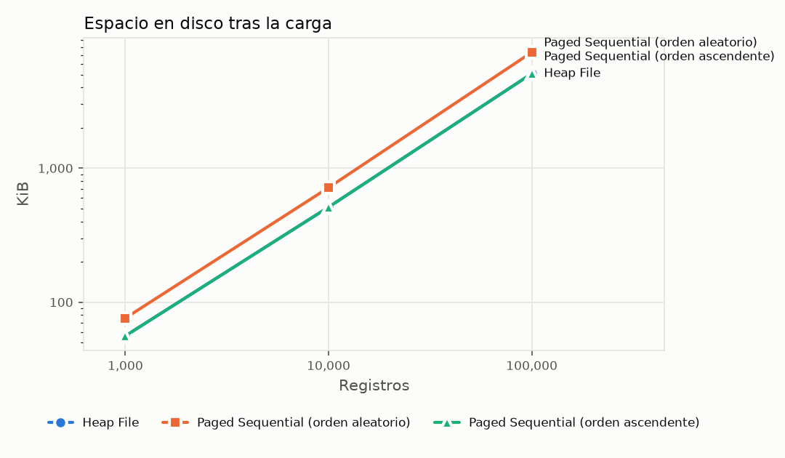

| Estructura | 1,000 (KiB) | 10,000 (KiB) | 100,000 (KiB) |
|---|---:|---:|---:|
| Heap File | 56.0 [56.0 – 56.0] (n=5) | 512.0 [512.0 – 512.0] (n=5) | 5,080.0 [5,080.0 – 5,080.0] (n=3) |
| Paged Sequential (orden aleatorio) | 76.0 [76.0 – 76.0] (n=5) | 716.0 [716.0 – 716.0] (n=5) | 7,328.0 [7,328.0 – 7,328.0] (n=3) |
| Paged Sequential (orden ascendente) | 56.0 [56.0 – 56.0] (n=5) | 512.0 [512.0 – 512.0] (n=5) | 5,084.0 [5,084.0 – 5,084.0] (n=3) |

## Reorganización del Paged Sequential tras borrar 40 %

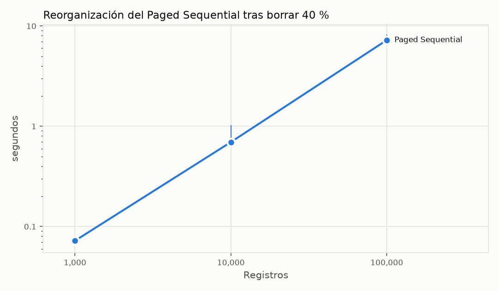

| Estructura | 1,000 (segundos) | 10,000 (segundos) | 100,000 (segundos) |
|---|---:|---:|---:|
| Paged Sequential | 0.072 [0.070 – 0.076] (n=5) | 0.695 [0.665 – 1.023] (n=5) | 7.238 [6.885 – 8.166] (n=3) |

## Construcción del índice

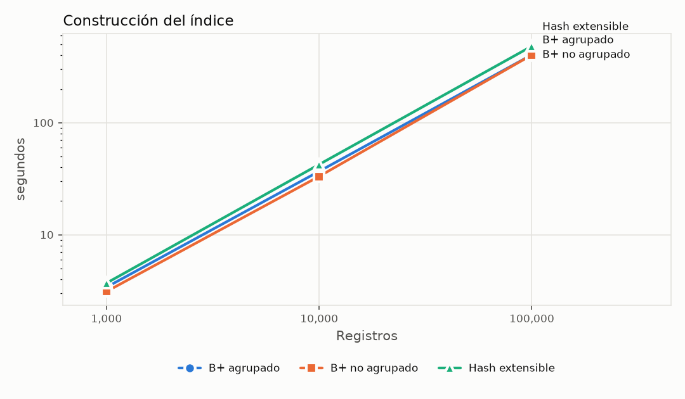

| Estructura | 1,000 (segundos) | 10,000 (segundos) | 100,000 (segundos) |
|---|---:|---:|---:|
| B+ agrupado | 3.395 [3.207 – 3.632] (n=5) | 36.8 [35.9 – 38.4] (n=5) | 403.9 [372.1 – 422.1] (n=3) |
| B+ no agrupado | 3.105 [3.037 – 3.434] (n=5) | 33.1 [32.6 – 35.7] (n=5) | 402.9 [350.8 – 410.1] (n=3) |
| Hash extensible | 3.692 [3.616 – 3.999] (n=5) | 42.4 [40.6 – 44.2] (n=5) | 482.6 [418.8 – 485.1] (n=3) |

## Espacio adicional del índice

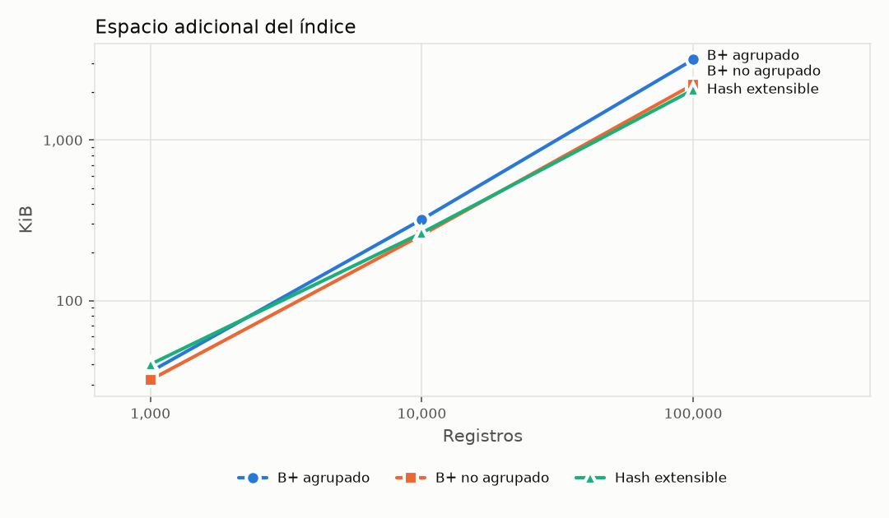

| Estructura | 1,000 (KiB) | 10,000 (KiB) | 100,000 (KiB) |
|---|---:|---:|---:|
| B+ agrupado | 36.0 [36.0 – 36.0] (n=5) | 320.0 [320.0 – 320.0] (n=5) | 3,172.0 [3,172.0 – 3,172.0] (n=3) |
| B+ no agrupado | 32.0 [32.0 – 32.0] (n=5) | 256.0 [256.0 – 256.0] (n=5) | 2,220.0 [2,220.0 – 2,220.0] (n=3) |
| Hash extensible | 40.0 [40.0 – 40.0] (n=5) | 264.0 [264.0 – 264.0] (n=5) | 2,056.0 [2,056.0 – 2,056.0] (n=3) |

## Búsqueda por igualdad (claves presentes)

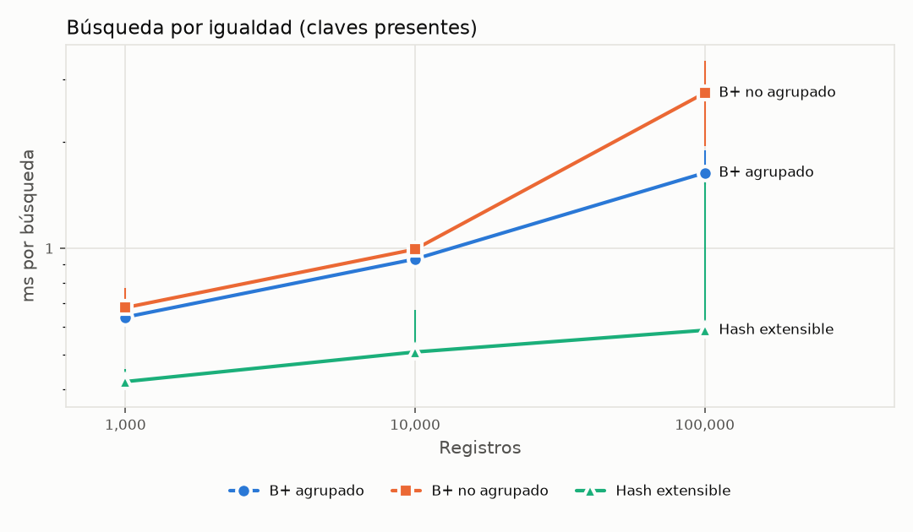

| Estructura | 1,000 (ms por búsqueda) | 10,000 (ms por búsqueda) | 100,000 (ms por búsqueda) |
|---|---:|---:|---:|
| B+ agrupado | 0.639 [0.606 – 0.704] (n=5) | 0.932 [0.901 – 0.994] (n=5) | 1.634 [1.514 – 1.889] (n=3) |
| B+ no agrupado | 0.680 [0.654 – 0.773] (n=5) | 0.993 [0.968 – 1.037] (n=5) | 2.747 [1.940 – 3.378] (n=3) |
| Hash extensible | 0.420 [0.397 – 0.457] (n=5) | 0.509 [0.485 – 0.671] (n=5) | 0.586 [0.572 – 1.540] (n=3) |

## Búsqueda por rango, selectividad 1 %

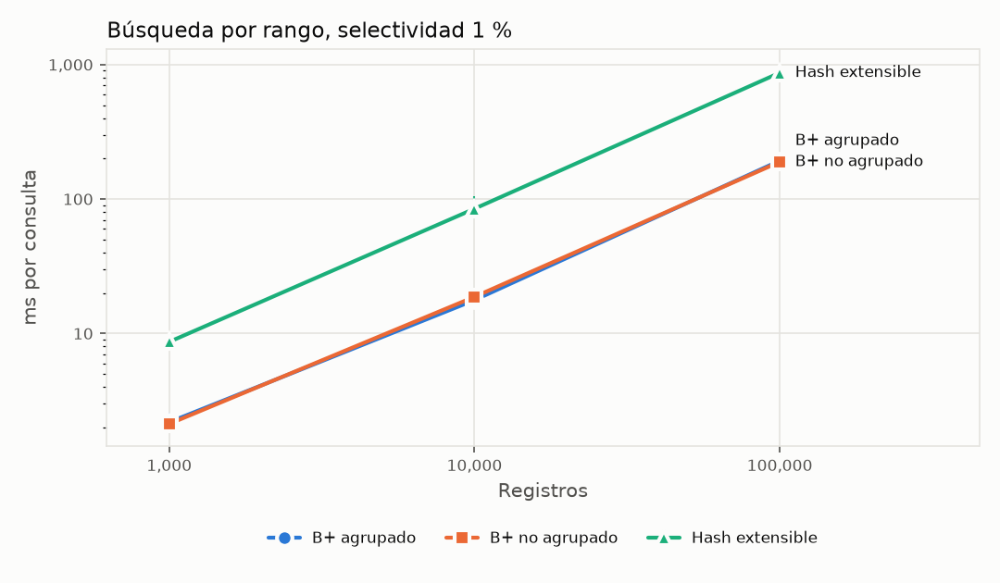

| Estructura | 1,000 (ms por consulta) | 10,000 (ms por consulta) | 100,000 (ms por consulta) |
|---|---:|---:|---:|
| B+ agrupado | 2.188 [1.996 – 2.585] (n=5) | 17.7 [17.4 – 18.3] (n=5) | 192.9 [166.9 – 206.4] (n=3) |
| B+ no agrupado | 2.125 [2.073 – 2.291] (n=5) | 18.7 [18.3 – 18.9] (n=5) | 189.0 [176.8 – 216.6] (n=3) |
| Hash extensible | 8.660 [8.046 – 8.977] (n=5) | 84.7 [83.4 – 104.6] (n=5) | 869.5 [793.2 – 958.5] (n=3) |

## Búsqueda por rango, selectividad 10 %

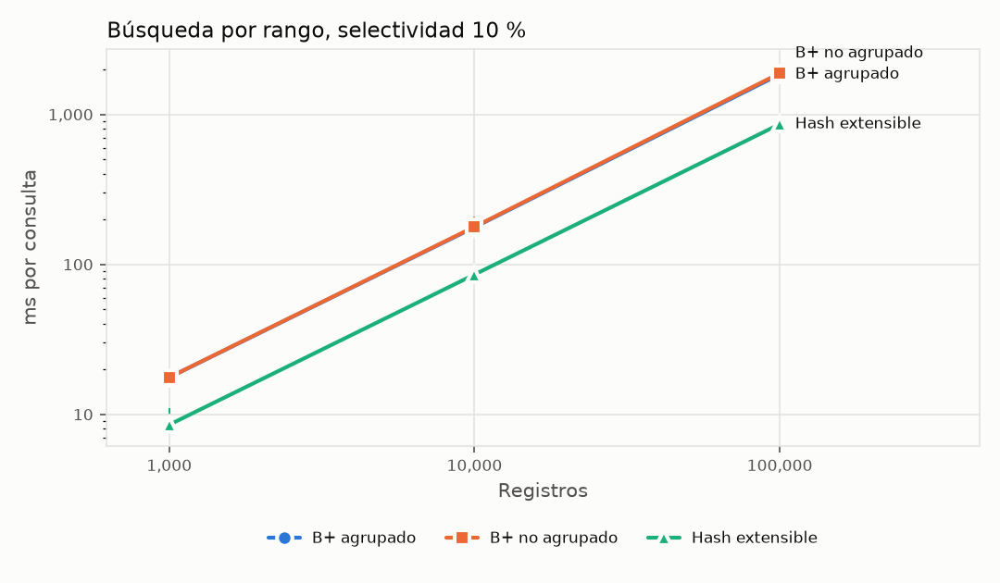

| Estructura | 1,000 (ms por consulta) | 10,000 (ms por consulta) | 100,000 (ms por consulta) |
|---|---:|---:|---:|
| B+ agrupado | 17.6 [16.9 – 18.4] (n=5) | 176.8 [171.5 – 181.9] (n=5) | 1,848.0 [1,683.2 – 2,067.0] (n=3) |
| B+ no agrupado | 17.7 [17.0 – 19.1] (n=5) | 178.0 [175.5 – 208.3] (n=5) | 1,879.3 [1,705.4 – 2,051.6] (n=3) |
| Hash extensible | 8.524 [8.167 – 11.0] (n=5) | 85.6 [81.4 – 96.7] (n=5) | 860.3 [800.9 – 967.5] (n=3) |

## Recuperación ordenada de toda la tabla

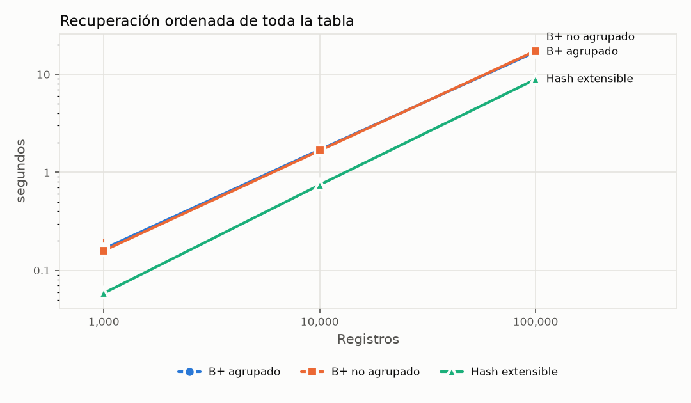

| Estructura | 1,000 (segundos) | 10,000 (segundos) | 100,000 (segundos) |
|---|---:|---:|---:|
| B+ agrupado | 0.166 [0.162 – 0.185] (n=5) | 1.701 [1.619 – 1.806] (n=5) | 17.0 [15.9 – 19.3] (n=3) |
| B+ no agrupado | 0.159 [0.157 – 0.209] (n=5) | 1.668 [1.626 – 1.972] (n=5) | 17.3 [16.3 – 18.7] (n=3) |
| Hash extensible | 0.058 [0.055 – 0.062] (n=5) | 0.746 [0.702 – 0.795] (n=5) | 8.919 [8.259 – 10.2] (n=3) |

## Inserciones y eliminaciones frecuentes

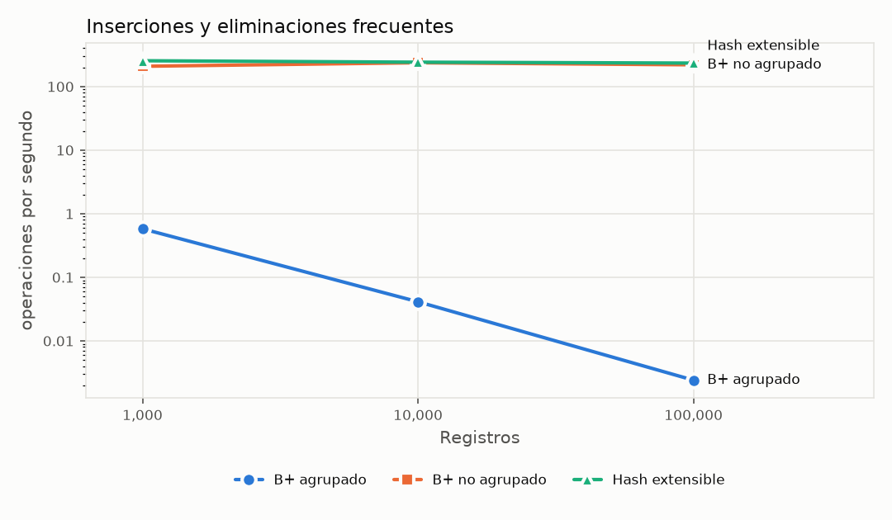

| Estructura | 1,000 (operaciones por segundo) | 10,000 (operaciones por segundo) | 100,000 (operaciones por segundo) |
|---|---:|---:|---:|
| B+ agrupado | 0.580 [0.558 – 0.600] (n=5) | 0.041 [0.040 – 0.042] (n=5) | 0.002 [0.002 – 0.003] (n=3) |
| B+ no agrupado | 208.4 [194.9 – 220.2] (n=5) | 236.9 [206.3 – 242.9] (n=5) | 219.7 [211.5 – 251.9] (n=3) |
| Hash extensible | 254.7 [245.5 – 267.8] (n=5) | 241.8 [232.0 – 244.0] (n=5) | 234.1 [233.0 – 265.7] (n=3) |

