# Resultados de la Etapa 10

Mediana de las repeticiones, con [mínimo – máximo]. Generado por `python -m benchmarks report` a partir de: `/local-user/.cache/minidbms-implementation-20261004/relational-first-delivery-ABa37I/results/results.jsonl`.

## Inserción de todos los registros

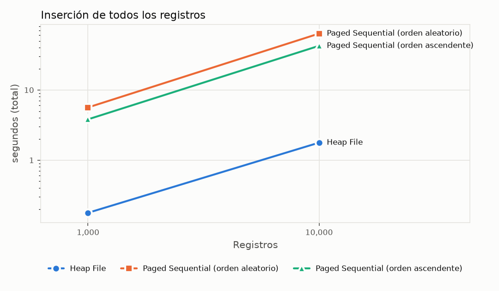

| Estructura | 1,000 (segundos (total)) | 10,000 (segundos (total)) |
|---|---:|---:|
| Heap File | 0.178 [0.174 – 0.180] (n=5) | 1.776 [1.771 – 1.812] (n=5) |
| Paged Sequential (orden aleatorio) | 5.636 [5.613 – 5.752] (n=5) | 63.6 [63.2 – 63.8] (n=5) |
| Paged Sequential (orden ascendente) | 3.815 [3.800 – 3.860] (n=5) | 42.5 [42.3 – 44.2] (n=5) |

## Búsqueda por clave primaria (claves presentes)

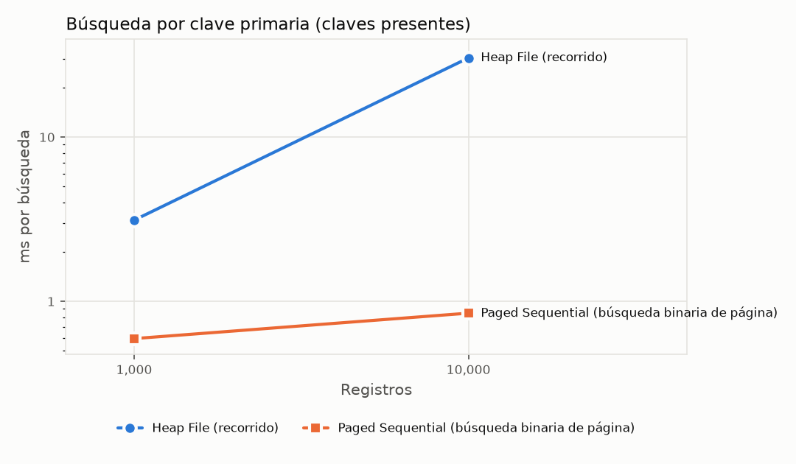

| Estructura | 1,000 (ms por búsqueda) | 10,000 (ms por búsqueda) |
|---|---:|---:|
| Heap File (recorrido) | 3.122 [2.930 – 3.217] (n=5) | 30.4 [28.7 – 32.4] (n=5) |
| Paged Sequential (búsqueda binaria de página) | 0.593 [0.585 – 0.609] (n=5) | 0.848 [0.836 – 0.863] (n=5) |

## Espacio en disco tras la carga

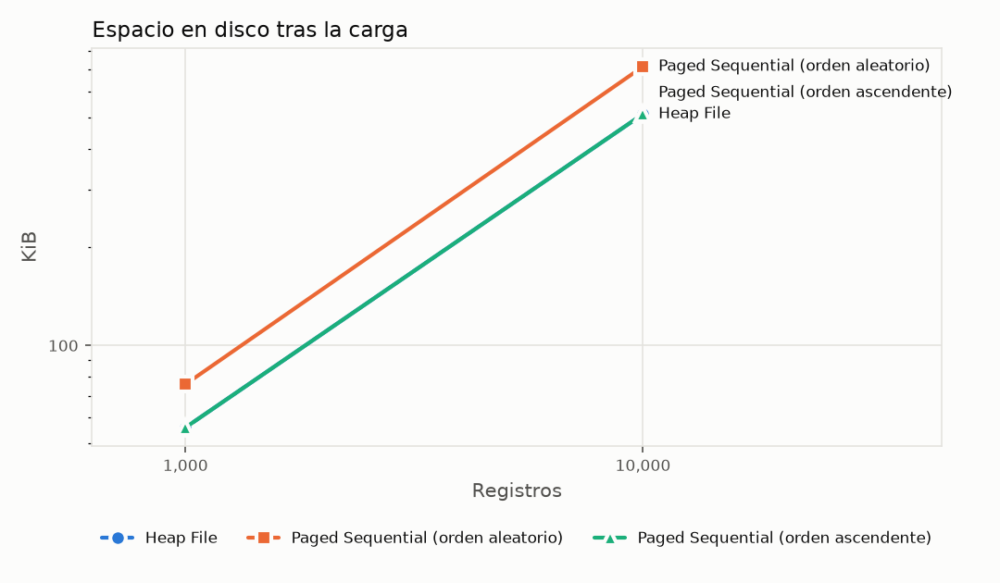

| Estructura | 1,000 (KiB) | 10,000 (KiB) |
|---|---:|---:|
| Heap File | 56.0 [56.0 – 56.0] (n=5) | 512.0 [512.0 – 512.0] (n=5) |
| Paged Sequential (orden aleatorio) | 76.0 [76.0 – 76.0] (n=5) | 716.0 [716.0 – 716.0] (n=5) |
| Paged Sequential (orden ascendente) | 56.0 [56.0 – 56.0] (n=5) | 512.0 [512.0 – 512.0] (n=5) |

## Reorganización del Paged Sequential tras borrar 40 %

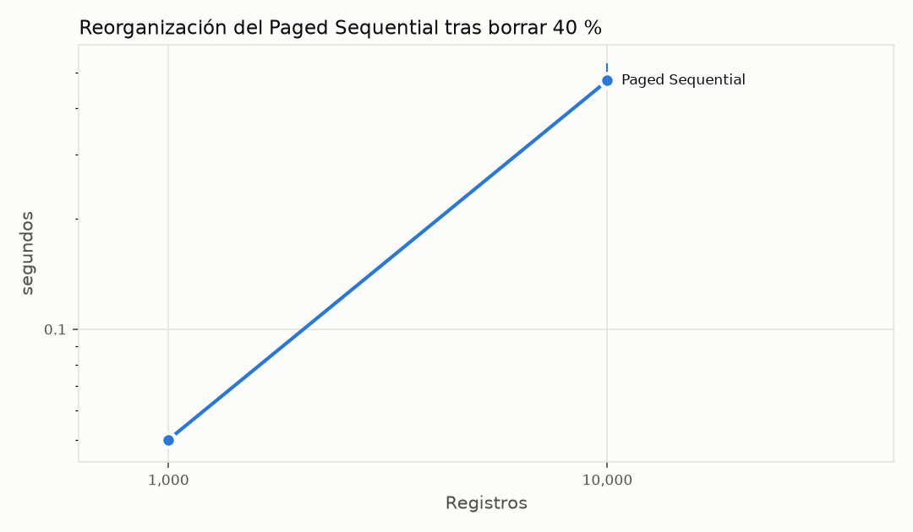

| Estructura | 1,000 (segundos) | 10,000 (segundos) |
|---|---:|---:|
| Paged Sequential | 0.050 [0.049 – 0.050] (n=5) | 0.476 [0.472 – 0.529] (n=5) |

## Construcción del índice

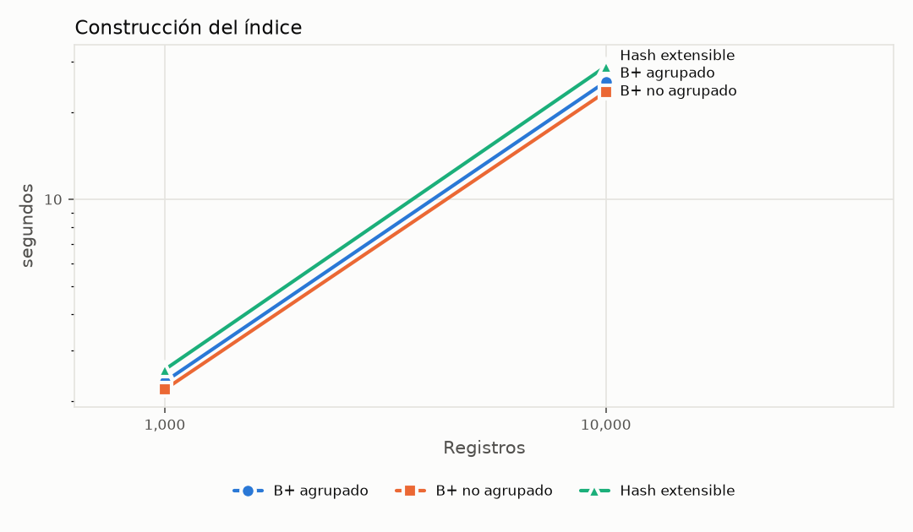

| Estructura | 1,000 (segundos) | 10,000 (segundos) |
|---|---:|---:|
| B+ agrupado | 2.331 [2.311 – 2.375] (n=5) | 25.6 [25.5 – 25.9] (n=5) |
| B+ no agrupado | 2.191 [2.179 – 2.250] (n=5) | 23.6 [23.5 – 24.0] (n=5) |
| Hash extensible | 2.568 [2.543 – 2.680] (n=5) | 28.9 [28.7 – 30.1] (n=5) |

## Espacio adicional del índice

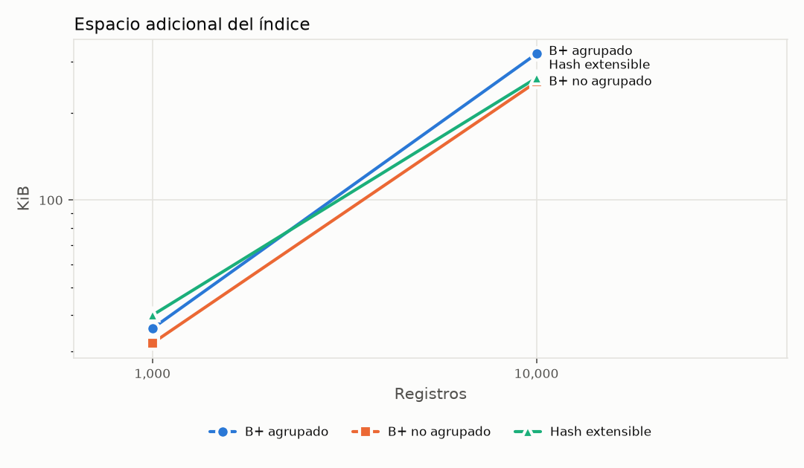

| Estructura | 1,000 (KiB) | 10,000 (KiB) |
|---|---:|---:|
| B+ agrupado | 36.0 [36.0 – 36.0] (n=5) | 320.0 [320.0 – 320.0] (n=5) |
| B+ no agrupado | 32.0 [32.0 – 32.0] (n=5) | 256.0 [256.0 – 256.0] (n=5) |
| Hash extensible | 40.0 [40.0 – 40.0] (n=5) | 264.0 [264.0 – 264.0] (n=5) |

## Búsqueda por igualdad (claves presentes)

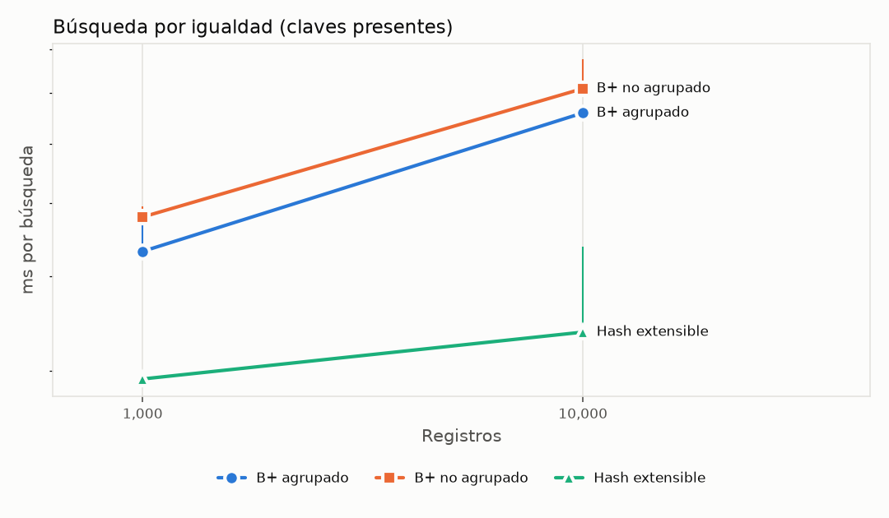

| Estructura | 1,000 (ms por búsqueda) | 10,000 (ms por búsqueda) |
|---|---:|---:|
| B+ agrupado | 0.432 [0.429 – 0.490] (n=5) | 0.659 [0.654 – 0.665] (n=5) |
| B+ no agrupado | 0.480 [0.475 – 0.496] (n=5) | 0.710 [0.698 – 0.776] (n=5) |
| Hash extensible | 0.293 [0.292 – 0.296] (n=5) | 0.338 [0.334 – 0.439] (n=5) |

## Búsqueda por rango, selectividad 1 %

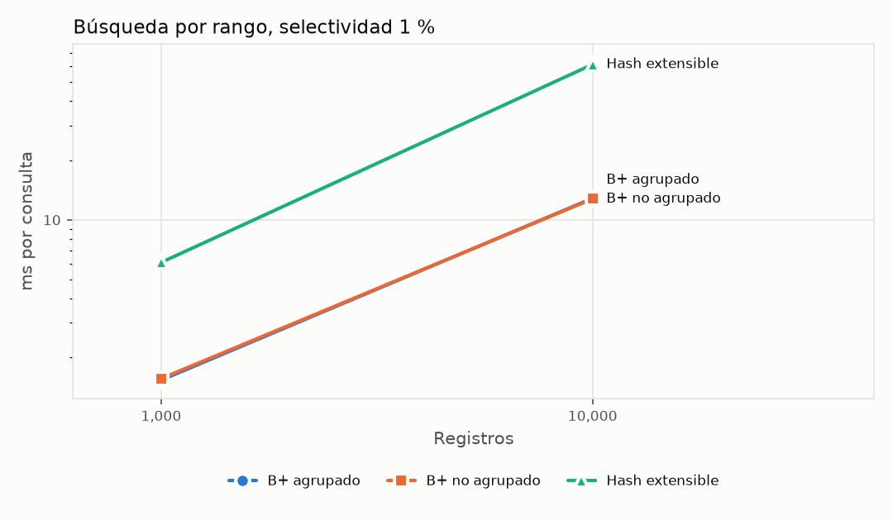

| Estructura | 1,000 (ms por consulta) | 10,000 (ms por consulta) |
|---|---:|---:|
| B+ agrupado | 1.538 [1.514 – 1.594] (n=5) | 12.9 [12.9 – 13.4] (n=5) |
| B+ no agrupado | 1.565 [1.502 – 1.594] (n=5) | 12.8 [12.6 – 13.6] (n=5) |
| Hash extensible | 6.079 [6.000 – 6.194] (n=5) | 61.5 [61.2 – 64.8] (n=5) |

## Búsqueda por rango, selectividad 10 %

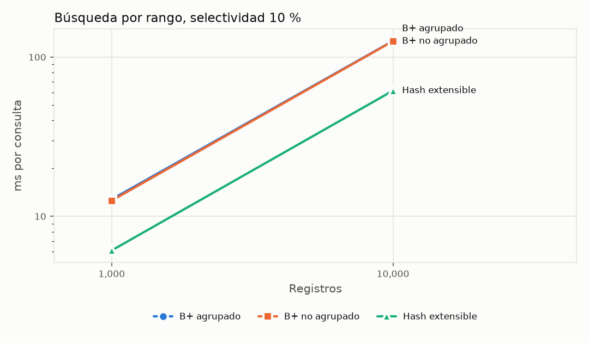

| Estructura | 1,000 (ms por consulta) | 10,000 (ms por consulta) |
|---|---:|---:|
| B+ agrupado | 12.8 [12.6 – 13.8] (n=5) | 126.2 [125.2 – 127.3] (n=5) |
| B+ no agrupado | 12.5 [12.4 – 12.8] (n=5) | 125.8 [124.4 – 129.0] (n=5) |
| Hash extensible | 6.102 [6.005 – 6.320] (n=5) | 61.5 [61.3 – 61.8] (n=5) |

## Recuperación ordenada de toda la tabla

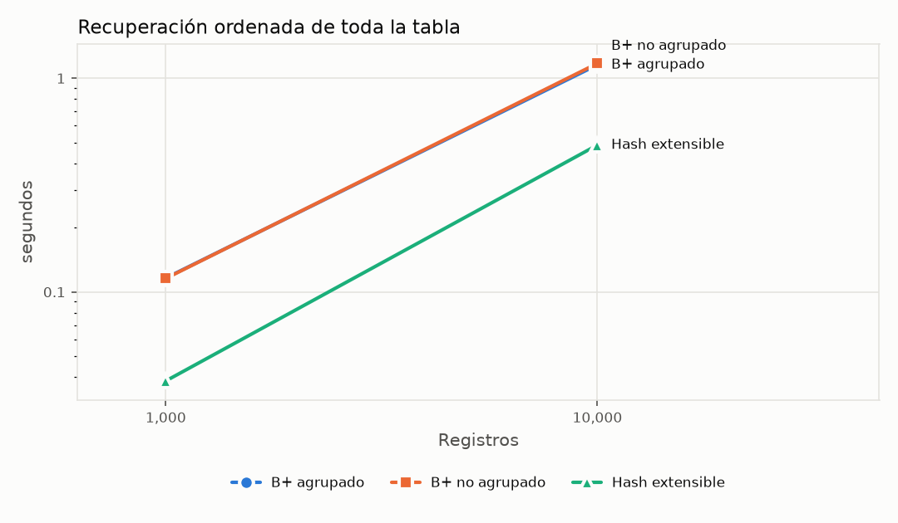

| Estructura | 1,000 (segundos) | 10,000 (segundos) |
|---|---:|---:|
| B+ agrupado | 0.116 [0.113 – 0.124] (n=5) | 1.155 [1.149 – 1.215] (n=5) |
| B+ no agrupado | 0.116 [0.115 – 0.116] (n=5) | 1.173 [1.163 – 1.185] (n=5) |
| Hash extensible | 0.038 [0.037 – 0.040] (n=5) | 0.487 [0.481 – 0.503] (n=5) |

## Inserciones y eliminaciones frecuentes

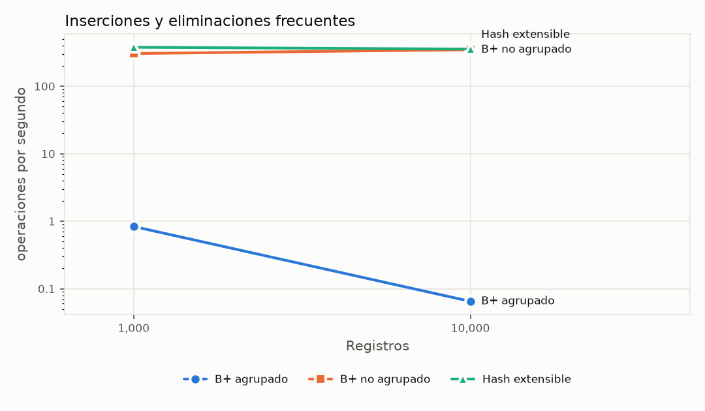

| Estructura | 1,000 (operaciones por segundo) | 10,000 (operaciones por segundo) |
|---|---:|---:|
| B+ agrupado | 0.835 [0.827 – 0.837] (n=5) | 0.065 [0.065 – 0.065] (n=5) |
| B+ no agrupado | 304.7 [300.5 – 315.3] (n=5) | 347.2 [338.4 – 354.1] (n=5) |
| Hash extensible | 377.1 [364.9 – 381.8] (n=5) | 354.6 [330.1 – 357.7] (n=5) |

